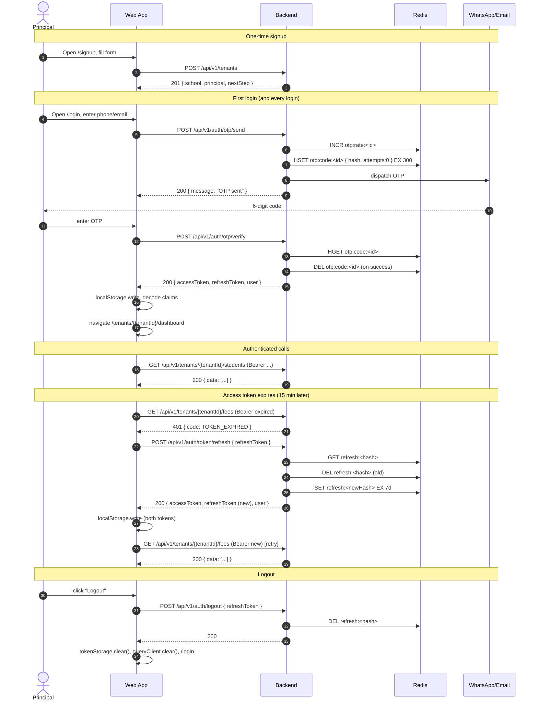

# 01 — Auth and Token Lifecycle

How a staff user goes from "never seen this app" to "making authenticated API calls" — every request/response shape, every failure mode, every piece of state the client must keep. Get this right and the other features wire themselves up. Get it wrong and every other page will look like it's broken.

**Source of truth** (scan these if any claim here is ambiguous):

- [AuthController](../../backend/src/main/java/in/schoolapp/auth/AuthController.java)
- [AuthService](../../backend/src/main/java/in/schoolapp/auth/AuthService.java)
- [OtpService](../../backend/src/main/java/in/schoolapp/auth/OtpService.java)
- [JwtService](../../backend/src/main/java/in/schoolapp/auth/JwtService.java)
- [JwtAuthFilter](../../backend/src/main/java/in/schoolapp/auth/JwtAuthFilter.java)
- [RefreshTokenService](../../backend/src/main/java/in/schoolapp/auth/RefreshTokenService.java)
- [SignupChannel](../../backend/src/main/java/in/schoolapp/auth/config/SignupChannel.java) / [SignupProperties](../../backend/src/main/java/in/schoolapp/auth/config/SignupProperties.java)
- [SecurityConfig](../../backend/src/main/java/in/schoolapp/config/SecurityConfig.java)
- [SchoolController](../../backend/src/main/java/in/schoolapp/school/SchoolController.java) (for signup)

Cross-refs: [02-api-reference.md](02-api-reference.md), [03-error-handling.md](03-error-handling.md), [04-multi-tenant-model.md](04-multi-tenant-model.md), [08-typescript-dto-reference.md](08-typescript-dto-reference.md).

---

## 1. The model in one paragraph

There is no password. A user identifies themselves with a phone number or email address; the server dispatches a 6-digit OTP to that channel (WhatsApp/SMS for phone, email for email), and a successful OTP verification yields a **JWT access token** (15-minute TTL by default) plus an opaque **refresh token** (7-day TTL by default, stored hashed in Redis). The access token carries `tenantId`, `staffId`, and `role` as claims. Refresh tokens rotate on every use — the old one is denylisted the moment a new one is issued. There are no sessions; the server is stateless apart from Redis holding `otp:*` and `refresh:*` keys.

---

## 2. Signup (first use)

A brand-new school creates its tenant via a **public** endpoint — no token required. The response bundles the freshly-minted `school`, `principal` (a `Staff` row), and current `academicYear`; the principal is the one who will log in next.

### Endpoint

```
POST /api/v1/tenants
Content-Type: application/json
```

Request body ([CreateSchoolRequest](../../backend/src/main/java/in/schoolapp/school/dto/CreateSchoolRequest.java)):

```json
{
  "schoolName": "Greenwood Public School",
  "principalName": "Asha Mehta",
  "phone": "9876543210",
  "email": "asha@greenwood.in",
  "state": "Maharashtra",
  "board": "CBSE",
  "city": "Pune"
}
```

**Field rules** — enforced partly by Bean Validation, partly by [SchoolService.createSchool](../../backend/src/main/java/in/schoolapp/school/SchoolService.java):

| Field | Required | Notes |
|---|---|---|
| `schoolName` | yes | ≤ 255 chars |
| `principalName` | yes | ≤ 255 chars |
| `phone` | see channel | 10-digit Indian mobile after normalisation |
| `email` | see channel | ≤ 255 chars |
| `state` | yes | ≤ 100 chars |
| `board` | yes | enum — `CBSE | ICSE | STATE | IB | OTHER` (see backend `Board`) |
| `city` | no | ≤ 100 chars |

**Phone/email requirement** depends on `app.signup.channel` on the server:

| Channel | Phone | Email |
|---|---|---|
| `PHONE` | required | optional |
| `EMAIL` | optional | required |
| `BOTH` | at least one required | at least one required |

Violations surface as `400 VALIDATION_ERROR` with messages like `"Phone number is required (signup channel: PHONE)"`. Duplicate phone/email (across any school or staff) also surfaces as `400 VALIDATION_ERROR`.

### Response

`201 Created`, envelope-wrapped [SchoolSignupResponse](../../backend/src/main/java/in/schoolapp/school/dto/SchoolSignupResponse.java):

```json
{
  "success": true,
  "data": {
    "school":      { "id": "…", "name": "Greenwood Public School", ... },
    "principal":   { "id": "…", "schoolId": "…", "firstName": "Asha", ... },
    "academicYear":{ "id": "…", "name": "2026-27", ... },
    "nextStep":    "SEND_PHONE_OTP"
  }
}
```

`nextStep` is either `"SEND_PHONE_OTP"` or `"SEND_EMAIL_OTP"` — the client should switch the login screen to that channel and prefill the identifier from the submitted form. **No token is returned.** The user must complete OTP verification (§3) to obtain one.

**What the frontend should persist** after signup: `tenantId` (`school.id`), `principalId` (`principal.id`), and the identifier used (so the OTP screen can prefill). These can live in sessionStorage — they're useful only until login completes.

---

## 3. Login — the OTP dance

Two endpoints, both under `/api/v1/auth/**` which [SecurityConfig](../../backend/src/main/java/in/schoolapp/config/SecurityConfig.java) marks `permitAll()`.

### 3.1 Send OTP

```
POST /api/v1/auth/otp/send
Content-Type: application/json
```

Request body ([SendOtpRequest](../../backend/src/main/java/in/schoolapp/auth/dto/SendOtpRequest.java)):

```json
{ "phone": "9876543210" }
```

or

```json
{ "email": "asha@greenwood.in" }
```

**Exactly one** of `phone` or `email` must be present — enforced by the `@AssertTrue isExactlyOneProvided()` check on the record. The server resolves the `IdentifierType` from whichever field is populated. There is **no explicit `identifierType` field** on the wire.

The server then, in order:

1. [AuthService.sendOtp](../../backend/src/main/java/in/schoolapp/auth/AuthService.java) checks `app.signup.channel` allows the identifier kind. If not → `400 VALIDATION_ERROR`.
2. Looks up a `Staff` with that normalised phone/email and `active = true`. **No match → `404 PHONE_NOT_FOUND`** (the code is historical; it also fires for email). The OTP slot is not burned.
3. [OtpService.sendOtp](../../backend/src/main/java/in/schoolapp/auth/OtpService.java) checks the per-identifier rate limit (`app.otp.maxSendsPerWindow` per `app.otp.rateLimitWindowMinutes`; default 5/10). Exceeded → `429 OTP_RATE_LIMITED`.
4. Generates a 6-digit OTP, HMAC-SHA256-hashes it with `app.otp.hmacSecret`, stores the hash in Redis under `otp:code:<identifier>` with a 5-minute TTL (`app.otp.ttlMinutes`), and dispatches the raw OTP via the configured `OtpDispatcher` (WhatsApp/SMS via WATI for phone; SMTP for email).

Response (`200 OK`):

```json
{ "success": true, "data": { "message": "OTP sent" } }
```

The response is intentionally minimal — the client must not learn whether the identifier exists from a successful response (it can still infer from the 404, which is a known tradeoff the backend accepts). Display the same "OTP sent" toast regardless of which error code you receive for send, if you want to harden against enumeration — but default behaviour is to show the exact `error.message`.

### 3.2 Verify OTP

```
POST /api/v1/auth/otp/verify
Content-Type: application/json
```

Request body ([VerifyOtpRequest](../../backend/src/main/java/in/schoolapp/auth/dto/VerifyOtpRequest.java)):

```json
{ "phone": "9876543210", "otp": "123456" }
```

or

```json
{ "email": "asha@greenwood.in", "otp": "123456" }
```

Same "exactly one identifier" rule. `otp` must match the regex `\d{6}`.

**The server**:

1. Re-normalises the identifier (same routine as send).
2. Looks up `otp:code:<identifier>` in Redis. Missing → `401 OTP_EXPIRED`.
3. Increments the `attempts` counter on the hash; > `app.otp.maxVerifyAttempts` (default 3) → deletes the key and returns `401 OTP_INVALID` ("Too many incorrect attempts. Request a new OTP.").
4. Constant-time compares the HMAC of the submitted OTP against the stored hash. Mismatch → `401 OTP_INVALID` ("Incorrect OTP"). Match → deletes the key (single-use), looks up the `Staff` row, builds the `AuthResponse`.

Response (`200 OK`), [AuthResponse](../../backend/src/main/java/in/schoolapp/auth/dto/AuthResponse.java):

```json
{
  "success": true,
  "data": {
    "accessToken":      "eyJhbGciOiJIUzI1NiJ9...",
    "refreshToken":     "9f3c9e1b-3b4a-4a2d-8e12-1a7b9c0d2f3e",
    "expiresInSeconds": 900,
    "user": {
      "id":         "…",
      "schoolId":   "…",
      "firstName":  "Asha",
      "lastName":   "Mehta",
      "displayName":"Asha Mehta",
      "phone":      "9876543210",
      "email":      "asha@greenwood.in",
      "role":       "PRINCIPAL",
      "active":     true
    }
  }
}
```

`expiresInSeconds` is `app.jwt.accessTokenExpiryMinutes * 60`. The refresh token is an opaque UUID string (the server stores only its SHA-256).

**What the frontend must persist on success**:

- `accessToken` (bearer)
- `refreshToken` (to request a new access token)
- `tenantId` = `user.schoolId` (also available as the `tenantId` JWT claim)
- `staffId` = `user.id`
- `role` = `user.role`
- `expiresAt` = `Date.now() + expiresInSeconds * 1000`

Storage: see §6. After storing, navigate to `/tenants/{tenantId}/dashboard`.

---

## 4. Making authenticated requests

Every call outside `/api/v1/auth/**`, `/api/v1/ping`, `POST /api/v1/tenants`, webhooks, and public `GET /files/**` must carry:

```
Authorization: Bearer <accessToken>
```

[JwtAuthFilter](../../backend/src/main/java/in/schoolapp/auth/JwtAuthFilter.java):

1. Strips `Bearer ` and parses the token via [JwtService.parse](../../backend/src/main/java/in/schoolapp/auth/JwtService.java).
2. On parse failure, writes a JSON error envelope directly:
   - `ExpiredJwtException` → `401 TOKEN_EXPIRED`, message `"Access token has expired"`
   - Any other `JwtException` / `IllegalArgumentException` → `401 TOKEN_INVALID`, message `"Access token is invalid"` (or `"Invalid access token"` for unexpected throwables)
3. On success, sets the Spring Security context (authorities `ROLE_<role>`) and `TenantContext` (tenantId, staffId, role). Downstream controllers/services read from `TenantContext`; the frontend doesn't see any of this but it's why you never pass `tenantId` in a request body.

**Missing `Authorization` header** is **not** rejected by the filter — the filter chain falls through and `SecurityConfig.authorizeHttpRequests(...).anyRequest().authenticated()` returns `401 UNAUTHORIZED` (mapped through `GlobalExceptionHandler` as `{ code: "UNAUTHORIZED", message: "Authentication required" }`). Treat both `TOKEN_EXPIRED` and generic `UNAUTHORIZED` as "go log in again," but only `TOKEN_EXPIRED` should trigger the silent refresh flow.

### 4.1 Reading the JWT claims

The payload has five claims:

| Claim | Type | Source |
|---|---|---|
| `sub` | UUID string | staff id |
| `tenantId` | UUID string | staff's school id |
| `role` | string | enum name: `PRINCIPAL`, `SCHOOL_OWNER`, `ADMIN`, `CLASS_TEACHER`, `SUBJECT_TEACHER`, `ACCOUNTANT` |
| `name` | string | `Staff.displayName()` |
| `exp` | epoch seconds | access-token expiry |

Decode with a tiny base64 helper (or `jose`, `jwt-decode`) — **never verify the signature client-side**. The server already did that. You're just reading claims.

```ts
export interface JwtClaims {
  sub: string;       // staffId (UUID)
  tenantId: string;
  role: AppRole;
  name: string;
  exp: number;       // seconds since epoch
  iat: number;
}

export function decodeJwt(token: string): JwtClaims {
  const [, payload] = token.split(".");
  const json = atob(payload.replace(/-/g, "+").replace(/_/g, "/"));
  return JSON.parse(decodeURIComponent(escape(json)));
}
```

In practice, the claims are redundant with the `user` object returned from OTP-verify — pick one source and stick to it. We prefer keeping the decoded claims alongside the tokens, since refreshing the access token gives you fresh claims but does **not** re-return the `user` profile (`AuthService.refresh` calls `buildAuthResponse`, which does re-fetch it — but prefer the JWT as the single source for `tenantId`/`role`/`staffId`).

---

## 5. Refresh rotation

```
POST /api/v1/auth/token/refresh
Content-Type: application/json
```

Request body ([RefreshTokenRequest](../../backend/src/main/java/in/schoolapp/auth/dto/RefreshTokenRequest.java)):

```json
{ "refreshToken": "9f3c9e1b-3b4a-4a2d-8e12-1a7b9c0d2f3e" }
```

[RefreshTokenService.rotate](../../backend/src/main/java/in/schoolapp/auth/RefreshTokenService.java):

1. SHA-256 hashes the submitted token.
2. Looks up `refresh:<hash>` in Redis. Missing → `401 TOKEN_EXPIRED` with message `"Refresh token is invalid or expired. Please log in again."`. Note: the **same error code `TOKEN_EXPIRED`** fires for both "expired" and "never existed / already rotated" — distinguishing them client-side isn't useful; both paths lead to `/login`.
3. **Deletes** the old key (denylisting the old token), returns the staff id.

`AuthService.refresh` then:

4. Loads the `Staff` row; if `active = false` → `401 UNAUTHORIZED` ("Account no longer active").
5. Issues a new access token + **new** refresh token (`RefreshTokenService.issue` creates a fresh UUID, stores the hash with the configured TTL).
6. Returns a full `AuthResponse` with the new tokens plus a re-serialised `user` profile.

**Rotation discipline** — the client must:

- Replace **both** `accessToken` and `refreshToken` with the fresh pair returned from refresh. If you keep using the old refresh token, the next attempt 401s.
- Coalesce concurrent refreshes. Two parallel 401s with `TOKEN_EXPIRED` triggering two refreshes is a race — one wins, the other 401s and kicks the user to `/login`. Single-flight the refresh call (§7.2).

### 5.1 When to refresh

Two strategies, pick one:

- **Reactive** (recommended for Phase 1): only refresh when an API call returns `401 TOKEN_EXPIRED`. Simpler, works fine with the 15-minute TTL.
- **Proactive**: a timer fires ~1 minute before `expiresAt` and calls refresh. Slightly better UX on idle tabs but adds a background concern. Avoid unless you hit a real pain point.

---

## 6. Token storage — the tradeoff

| Storage | XSS-exposed? | CSRF-exposed? | JS can read? | Backend support needed |
|---|---|---|---|---|
| `localStorage` | yes | no | yes | none |
| `sessionStorage` | yes | no | yes | none (cleared on tab close — annoying for users) |
| `httpOnly` cookie | no | **yes — needs CSRF protection** | no | CSRF filter + `SameSite=Strict` + refresh-cookie endpoint |
| In-memory only | no (but any XSS can still exfil) | no | yes (current tab) | none |

**Phase 1 recommendation: localStorage.** The backend does not expose a CSRF token endpoint — `SecurityConfig` calls `.csrf(AbstractHttpConfigurer::disable)` because the entire API is JSON + Bearer and stateless. Switching to httpOnly cookies requires backend work (a CSRF filter, a `Set-Cookie` path on `/auth/otp/verify` and `/auth/token/refresh`). Not worth it for an internal-admin audience.

Mitigations that are already in place, making localStorage defensible:

- **CSP** in [SecurityConfig](../../backend/src/main/java/in/schoolapp/config/SecurityConfig.java) forbids inline scripts (`script-src 'self'`), inline frames (`frame-ancestors 'none'`), and cross-origin loads (`connect-src 'self'`). This neutralises the most common XSS exfil paths.
- **HSTS** with `preload` prevents downgrade attacks.
- **CORS** allowlist is explicit (`app.schoolapp.in`, `localhost:3000/5173`).

**Client-side additional mitigations**:

- Only ever use React's default escaping — never `dangerouslySetInnerHTML` with user-provided HTML.
- Sanitise any rich-text fields (circular bodies, inbox notes) with DOMPurify before render.
- Never load third-party scripts. If you need analytics, use a first-party proxy.
- Treat the refresh token as a password — never log it, never put it in a URL, never expose it in error messages.

**Migration path to cookies** (Phase 2+): have the backend set `Set-Cookie: sms_refresh=<token>; HttpOnly; Secure; SameSite=Strict; Path=/api/v1/auth/token/refresh` on verify + rotate, stop returning the refresh token in the JSON body, add a CSRF double-submit token. No frontend-observable change for access tokens — they stay in memory. That's ~4 days of backend work; defer until a security review demands it.

### 6.1 Threat model summary

| Threat | Likelihood | Impact | Mitigation today |
|---|---|---|---|
| XSS reads localStorage | low (no inline scripts, no 3P JS) | high (token theft) | CSP + code review + DOMPurify for rich text |
| Network sniffing | very low | high | TLS 1.2+, HSTS preload |
| Phishing for OTP | medium | high | Short TTL (5 min), 3-attempt lockout, rate limit (5/10min) |
| Refresh-token replay after logout | zero | n/a | Server denylists the hash on logout/rotate |
| Tenant-swap via URL tampering | zero on protected routes | high | `TenantInterceptor` rejects mismatch; see [04-multi-tenant-model.md](04-multi-tenant-model.md) |
| Token leak via browser extension | low | high | No mitigation — same risk as any webapp |
| Stolen device, unlocked | low | high | No mitigation — same risk as any webapp |

### 6.2 Storage helpers

```ts
// src/auth/tokenStorage.ts
const ACCESS_KEY  = "sms.accessToken";
const REFRESH_KEY = "sms.refreshToken";
const EXP_KEY     = "sms.expiresAt";

export interface StoredAuth {
  accessToken: string;
  refreshToken: string;
  expiresAt: number;          // epoch ms
}

export const tokenStorage = {
  read(): StoredAuth | null {
    const accessToken  = localStorage.getItem(ACCESS_KEY);
    const refreshToken = localStorage.getItem(REFRESH_KEY);
    const expiresAt    = localStorage.getItem(EXP_KEY);
    if (!accessToken || !refreshToken || !expiresAt) return null;
    return { accessToken, refreshToken, expiresAt: Number(expiresAt) };
  },
  write(a: StoredAuth) {
    localStorage.setItem(ACCESS_KEY,  a.accessToken);
    localStorage.setItem(REFRESH_KEY, a.refreshToken);
    localStorage.setItem(EXP_KEY,     String(a.expiresAt));
  },
  clear() {
    localStorage.removeItem(ACCESS_KEY);
    localStorage.removeItem(REFRESH_KEY);
    localStorage.removeItem(EXP_KEY);
  },
};
```

---

## 7. axios instance — the whole thing

### 7.1 Request interceptor (attach bearer)

```ts
// src/api/client.ts
import axios, { AxiosError, AxiosRequestConfig } from "axios";
import { tokenStorage } from "../auth/tokenStorage";
import { ApiError } from "./errors";          // see 03-error-handling.md

export const apiClient = axios.create({
  baseURL: import.meta.env.VITE_API_BASE_URL,
  headers: { "Content-Type": "application/json" },
});

apiClient.interceptors.request.use((config) => {
  const auth = tokenStorage.read();
  if (auth?.accessToken) {
    config.headers.set("Authorization", `Bearer ${auth.accessToken}`);
  }
  return config;
});
```

### 7.2 Response interceptor (refresh + retry, single-flight)

```ts
// src/api/client.ts (continued)

type Retryable = AxiosRequestConfig & { _retried?: boolean };

/** Single-flight promise: concurrent 401s share one refresh. */
let refreshInFlight: Promise<string> | null = null;

async function refreshAccessToken(): Promise<string> {
  if (refreshInFlight) return refreshInFlight;
  refreshInFlight = (async () => {
    const current = tokenStorage.read();
    if (!current) throw new Error("no refresh token");
    try {
      // Bypass the axios instance's interceptor (old bearer is expired/useless).
      const res = await axios.post(
        `${import.meta.env.VITE_API_BASE_URL}/api/v1/auth/token/refresh`,
        { refreshToken: current.refreshToken },
      );
      const { accessToken, refreshToken, expiresInSeconds } = res.data.data;
      tokenStorage.write({
        accessToken,
        refreshToken,
        expiresAt: Date.now() + expiresInSeconds * 1000,
      });
      return accessToken;
    } finally {
      refreshInFlight = null;
    }
  })();
  return refreshInFlight;
}

function redirectToLogin() {
  tokenStorage.clear();
  const here = window.location.pathname + window.location.search;
  const param = here && here !== "/login"
    ? `?redirect=${encodeURIComponent(here)}`
    : "";
  window.location.assign(`/login${param}`);
}

apiClient.interceptors.response.use(
  (res) => {
    // Happy path — unwrap envelope. (ApiError mapping lives in 03-error-handling.md.)
    const body = res.data;
    if (body && body.success === false) {
      throw ApiError.from(body.error, res.status);
    }
    return res;
  },
  async (err: AxiosError) => {
    const response = err.response;
    const config   = err.config as Retryable | undefined;
    if (!response || !config) throw ApiError.network(err);

    const code = (response.data as any)?.error?.code as string | undefined;

    // Only retry on TOKEN_EXPIRED, and only once per request.
    if (response.status === 401 && code === "TOKEN_EXPIRED" && !config._retried) {
      config._retried = true;
      try {
        const fresh = await refreshAccessToken();
        config.headers = { ...(config.headers ?? {}), Authorization: `Bearer ${fresh}` };
        return apiClient.request(config);
      } catch {
        redirectToLogin();
        throw ApiError.from({ code: "TOKEN_EXPIRED", message: "Session expired" }, 401);
      }
    }

    // Any other 401 (bad token, missing token, refresh itself failed) → login.
    if (response.status === 401) {
      redirectToLogin();
    }

    throw ApiError.from((response.data as any)?.error, response.status);
  },
);
```

Notes:

- The refresh uses a bare `axios.post` rather than `apiClient.post` to avoid a refresh-inside-refresh recursion.
- `_retried` guards against a double-401 loop — after one refresh + retry, the next 401 falls through to the login redirect.
- Single-flight (`refreshInFlight`) is mandatory. Without it, a dashboard that fan-fires ten queries will fire ten refreshes, nine of which 401 the old token and kick the user out.

---

## 8. Logout

```
POST /api/v1/auth/logout
Content-Type: application/json
```

Request body (optional — the endpoint accepts `null`):

```json
{ "refreshToken": "9f3c9e1b-3b4a-4a2d-8e12-1a7b9c0d2f3e" }
```

[AuthService.logout](../../backend/src/main/java/in/schoolapp/auth/AuthService.java) deletes `refresh:<hash>` from Redis. **The access token continues to work until it expires** — JWTs are stateless and there's no server-side deny-list for access tokens. For the 15 minutes after logout, a stolen access token is still valid; accept this and minimise the window by keeping the access-token TTL short.

**Client sequence**:

1. Call `POST /api/v1/auth/logout` with the refresh token (fire-and-forget — a failure here shouldn't block the UI).
2. `tokenStorage.clear()`.
3. React Query `queryClient.clear()` (drop all cached responses).
4. Navigate to `/login`.

Response is a trivial `{ success: true, data: { message: "Logged out" } }`.

---

## 9. AuthProvider + useAuth hook

```tsx
// src/auth/AuthProvider.tsx
import { createContext, useContext, useEffect, useMemo, useState } from "react";
import { tokenStorage } from "./tokenStorage";
import { decodeJwt, JwtClaims } from "./jwt";
import { apiClient } from "../api/client";

type AuthState =
  | { status: "loading" }
  | { status: "anonymous" }
  | { status: "authenticated"; claims: JwtClaims };

const AuthContext = createContext<{
  state: AuthState;
  loginWithOtp: (req: VerifyOtpInput) => Promise<void>;
  sendOtp: (req: SendOtpInput) => Promise<void>;
  logout: () => Promise<void>;
} | null>(null);

export function AuthProvider({ children }: { children: React.ReactNode }) {
  const [state, setState] = useState<AuthState>({ status: "loading" });

  useEffect(() => {
    const stored = tokenStorage.read();
    if (!stored) return setState({ status: "anonymous" });
    try {
      const claims = decodeJwt(stored.accessToken);
      // Don't pre-validate `exp` — the interceptor will handle refresh on 401.
      setState({ status: "authenticated", claims });
    } catch {
      tokenStorage.clear();
      setState({ status: "anonymous" });
    }
  }, []);

  const value = useMemo(() => ({
    state,
    sendOtp: async (req: SendOtpInput) => {
      await apiClient.post("/api/v1/auth/otp/send", req);
    },
    loginWithOtp: async (req: VerifyOtpInput) => {
      const res = await apiClient.post("/api/v1/auth/otp/verify", req);
      const { accessToken, refreshToken, expiresInSeconds } = res.data.data;
      tokenStorage.write({
        accessToken, refreshToken,
        expiresAt: Date.now() + expiresInSeconds * 1000,
      });
      setState({ status: "authenticated", claims: decodeJwt(accessToken) });
    },
    logout: async () => {
      const current = tokenStorage.read();
      try { await apiClient.post("/api/v1/auth/logout", { refreshToken: current?.refreshToken }); }
      catch { /* swallow — best-effort */ }
      tokenStorage.clear();
      setState({ status: "anonymous" });
    },
  }), [state]);

  return <AuthContext.Provider value={value}>{children}</AuthContext.Provider>;
}

export function useAuth() {
  const ctx = useContext(AuthContext);
  if (!ctx) throw new Error("useAuth must be inside <AuthProvider>");
  return ctx;
}
```

### 9.1 OTP mutations (React Query form)

If you prefer mutations over imperative `loginWithOtp`:

```ts
// src/features/auth/api.ts
import { useMutation } from "@tanstack/react-query";
import { apiClient } from "../../api/client";

export interface SendOtpInput  { phone?: string; email?: string; }
export interface VerifyOtpInput { phone?: string; email?: string; otp: string; }

export function useSendOtpMutation() {
  return useMutation({
    mutationFn: async (input: SendOtpInput) => {
      const res = await apiClient.post("/api/v1/auth/otp/send", input);
      return res.data.data as { message: string };
    },
  });
}

export function useVerifyOtpMutation() {
  // Consuming component reads tokens from the response and calls tokenStorage.write.
  return useMutation({
    mutationFn: async (input: VerifyOtpInput) => {
      const res = await apiClient.post("/api/v1/auth/otp/verify", input);
      return res.data.data as AuthResponse;    // see 08-typescript-dto-reference.md
    },
  });
}
```

---

## 10. Login screen UX (prose wireframe)

Route: `/login` (the only unauthenticated route besides `/signup`).

**State machine**, three screens:

1. **Identifier entry**
   - Single input — phone or email based on `VITE_SIGNUP_CHANNEL` (see §12).
   - Submit button "Send OTP".
   - On submit → `useSendOtpMutation`.
   - Success → move to screen 2. Error toast on `PHONE_NOT_FOUND`, `OTP_RATE_LIMITED`, `VALIDATION_ERROR`.
2. **OTP entry**
   - 6-digit input, autoFocus, inputMode="numeric".
   - "Resend OTP" link with a 30-second cooldown (client-side) — hitting send again before cooldown just calls the endpoint and lets the server 429 if needed.
   - "Change phone/email" link → back to screen 1.
   - On submit → `useVerifyOtpMutation`.
   - Success → store tokens, decode claims, navigate to `redirect` query param or `/tenants/{tenantId}/dashboard`.
   - Errors inline under the input: `OTP_INVALID`, `OTP_EXPIRED`.
3. **Loading → landing**
   - After verify, show a spinner for <500ms while React Query prefetches the dashboard.

**Deep-link preservation**: if the user arrived at `/login?redirect=/tenants/abc/students`, the interceptor put that there, and the success handler uses it. Validate the redirect is a same-origin relative path (`/tenants/...`) — reject absolute URLs or `//evil.com` paths.

---

## 11. End-to-end sequence (mermaid)



---

## 12. Signup channel — UI variants

The server setting `app.signup.channel` ∈ { `PHONE`, `EMAIL`, `BOTH` } governs both signup and login identifier acceptance. The backend does **not** expose this via an endpoint — the frontend reads it from Vite env at build time:

```env
# Match the backend's app.signup.channel
VITE_SIGNUP_CHANNEL=PHONE   # or EMAIL or BOTH
```

**Signup form**:

| Channel | Show phone field? | Show email field? | Required fields |
|---|---|---|---|
| `PHONE` | yes, required | yes, optional | phone |
| `EMAIL` | yes, optional | yes, required | email |
| `BOTH`  | yes, optional | yes, optional | at least one (show a form-level error) |

**Login form** — exactly one of phone/email per request, so:

| Channel | UI choice |
|---|---|
| `PHONE` | single phone input |
| `EMAIL` | single email input |
| `BOTH`  | tabbed switch: "Phone" / "Email" with one input per tab |

If the frontend sends an identifier the server's channel doesn't allow, the response is `400 VALIDATION_ERROR` with a message like `"Login via EMAIL is disabled (signup channel: PHONE)"`. Since the frontend config mirrors the server, this should only happen when the two drift — treat it as a developer error (fix env) rather than an end-user message.

---

## 13. Error code reference (auth-scoped)

Full list and rendering guidance in [03-error-handling.md](03-error-handling.md). Auth-specific codes:

| Code | HTTP | Thrown by | User-facing message |
|---|---|---|---|
| `PHONE_NOT_FOUND` | 404 | `AuthService.sendOtp`, `AuthService.verifyOtp` | "No active account is registered with this phone / email" (message from server is already user-ready) |
| `OTP_INVALID` | 401 | `OtpService.verifyOtp` | "Incorrect OTP" / "Too many incorrect attempts. Request a new OTP." |
| `OTP_EXPIRED` | 401 | `OtpService.verifyOtp` | "OTP has expired or was never requested" |
| `OTP_RATE_LIMITED` | 429 | `OtpService.sendOtp` | "Too many OTP requests. Please try again later." — disable the send button for 60s as UX |
| `TOKEN_EXPIRED` | 401 | `JwtService.parse`, `RefreshTokenService.rotate` | **don't show** — handled silently by the refresh interceptor. If refresh itself 401s, redirect to `/login` with a toast "Your session expired, please log in again." |
| `TOKEN_INVALID` | 401 | `JwtService.parse`, `JwtAuthFilter` fallback | Redirect to `/login`, toast "Please log in again." |
| `UNAUTHORIZED` | 401 | `TenantContext.validateTenant` (no JWT), `GlobalExceptionHandler` (Spring Security throw), `AuthService.refresh` (staff deactivated) | Redirect to `/login`. If refresh returned this, message "Your account has been deactivated" (the server says so). |
| `FORBIDDEN` | 403 | `TenantContext.validateTenant` (tenant mismatch), `GlobalExceptionHandler` (`@PreAuthorize` rejection) | Route guard — show "Access denied" page. Never auto-retry. |
| `VALIDATION_ERROR` | 400 | many (including signup channel violations and phone/email normalisation) | Render `message` inline on the form. For signup, also read `details.fieldErrors` (see [03-error-handling.md](03-error-handling.md)). |

---

## 14. Rate limiting (non-auth endpoints)

[RateLimitFilter](../../backend/src/main/java/in/schoolapp/config/RateLimitFilter.java) applies to **`/api/v1/**`** except `/api/v1/auth/**`, `/api/v1/ping`, `/webhooks/**`, `/actuator/**`. Default 600 requests per minute per authenticated staff (falling back to IP for pre-auth endpoints). Exceeded → `429 RATE_LIMIT_EXCEEDED`, `Retry-After: 60` header.

**Frontend handling**:

- Wrap the axios response interceptor to detect `429 RATE_LIMIT_EXCEEDED` and show a warning toast: "We're throttling your requests. Try again in a moment."
- Exponential back-off inside React Query: `retry: (count, err) => err instanceof ApiError && err.code === "RATE_LIMIT_EXCEEDED" && count < 3`, `retryDelay: (count) => 1000 * Math.pow(2, count)`.
- 600/min is generous — hitting it usually means a runaway useEffect. Profile before assuming the limit is wrong.

OTP endpoints have their own rate limit (in `OtpService`, not `RateLimitFilter`): `app.otp.maxSendsPerWindow` sends per `app.otp.rateLimitWindowMinutes`. Defaults are conservative (5/10min). Surface `OTP_RATE_LIMITED` explicitly on the login screen — "Try again in a few minutes," disable the resend button for 60s.

---

## 15. Checklist for a working auth integration

Tick these off before declaring auth done:

- [ ] Signup form branches on `VITE_SIGNUP_CHANNEL` (phone / email / both).
- [ ] `POST /api/v1/tenants` call handles `VALIDATION_ERROR` (duplicate, channel mismatch) inline on the form.
- [ ] Login OTP-send screen handles `PHONE_NOT_FOUND`, `OTP_RATE_LIMITED` with specific copy.
- [ ] OTP-verify screen handles `OTP_INVALID`, `OTP_EXPIRED` inline, other errors via toast.
- [ ] On verify success, both tokens + `expiresAt` are persisted, then navigate to `redirect` or `/tenants/{tenantId}/dashboard`.
- [ ] axios request interceptor attaches `Authorization: Bearer ...`.
- [ ] axios response interceptor: unwraps envelope; on `401 TOKEN_EXPIRED` + not already retried → single-flight refresh → retry once; on any other 401 → clear + `/login`.
- [ ] Refresh stores the **new** refresh token, not just the access token.
- [ ] Concurrent requests share a single refresh via a module-level promise.
- [ ] `/login?redirect=<path>` is honoured and validated as same-origin.
- [ ] Logout calls the endpoint, clears storage, clears React Query cache, navigates to `/login`.
- [ ] Route guard: if `tokenStorage.read()` is null, redirect to `/login`. If the decoded JWT's `tenantId` ≠ the URL's `:tenantId`, redirect to `/login` (see [04-multi-tenant-model.md](04-multi-tenant-model.md)).
- [ ] 403 pages exist for role-denial and tenant-mismatch (never retry a 403).
- [ ] 429 `RATE_LIMIT_EXCEEDED` toast + exponential back-off on React Query retries.
- [ ] Never log the refresh token. Never put it in a URL.

If all of these are true, every other feature page can focus on its own domain and stop thinking about auth.
