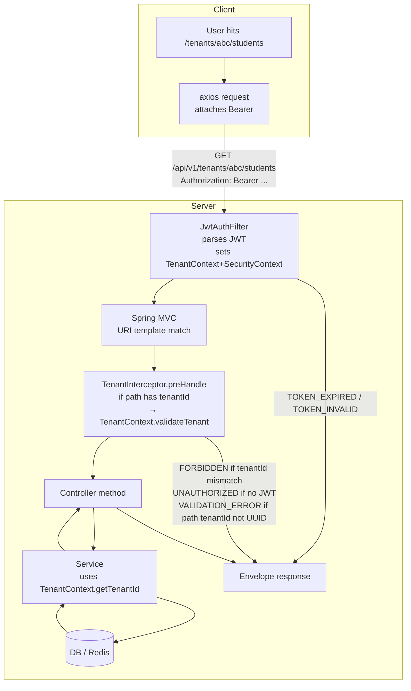

# 04 — Multi-Tenant Model

One invariant drives every URL, every query, every audit row: **a tenant (school) is a hard boundary, and the boundary is enforced by the server at two places — the JWT claim and the URL path.** Mismatch is a 403.

**Source of truth**:

- [TenantContext](../../backend/src/main/java/in/schoolapp/common/TenantContext.java)
- [TenantInterceptor](../../backend/src/main/java/in/schoolapp/common/TenantInterceptor.java)
- [WebMvcConfig](../../backend/src/main/java/in/schoolapp/config/WebMvcConfig.java) (registers the interceptor for `/api/**` except `/api/v1/auth/**`)
- [JwtAuthFilter](../../backend/src/main/java/in/schoolapp/auth/JwtAuthFilter.java) (populates `TenantContext` from the JWT)
- [SchoolController](../../backend/src/main/java/in/schoolapp/school/SchoolController.java) (canonical `/api/v1/tenants/{tenantId}/...` shape)

Cross-refs: [01-auth-and-token-lifecycle.md](01-auth-and-token-lifecycle.md), [02-api-reference.md](02-api-reference.md), [05-role-matrix.md](05-role-matrix.md).

---

## 1. The invariant

> Every tenant-scoped URL is `/api/v1/tenants/{tenantId}/...`. The JWT carries `tenantId` as a claim. `TenantInterceptor` compares them on every request. Mismatch → `403 FORBIDDEN`, message `"Request tenant does not match authenticated tenant"`.

`tenantId` is a **UUID** (server-generated at signup). A tenant maps 1:1 to a `School` row — internally, services still pass the value around as `schoolId` because that's the DB column. At the URL/auth layer the word is "tenant" for SaaS clarity.

---

## 2. Why `tenantId` lives in the URL

It could, theoretically, be implicit in the JWT — and the server could drop it from every path. It lives in the URL on purpose:

- **Explicit in logs, traces, audit** — every access log line already shows which tenant was touched; nobody has to cross-reference the token.
- **Shareable / bookmarkable** — a principal's URL to a specific student page is stable and readable: `/tenants/<uuid>/students/<uuid>`.
- **CDN-safe** — response caching (when we add it) can key on the path without decoding the JWT.
- **Cross-check against the JWT** — see §6. If someone tampers with the URL but keeps their valid token, the interceptor catches it.

The cost is URL length. That's fine.

---

## 3. Frontend URL mirror

The web app's client-side routes **mirror** the backend paths but drop the `/api/v1` prefix (the frontend router doesn't care about transport, only the conceptual path):

```
/login
/signup
/access-denied
/tenants/:tenantId/dashboard
/tenants/:tenantId/students
/tenants/:tenantId/students/:studentId
/tenants/:tenantId/attendance
/tenants/:tenantId/fees
/tenants/:tenantId/fees/dashboard
/tenants/:tenantId/academics/exams
/tenants/:tenantId/academics/exams/:examId/marks/:sectionId
/tenants/:tenantId/alerts
/tenants/:tenantId/inbox
/tenants/:tenantId/circulars
/tenants/:tenantId/settings/school
/tenants/:tenantId/settings/staff
/tenants/:tenantId/settings/fee-heads
/tenants/:tenantId/settings/reminder-schedules
```

When the frontend calls the backend, it reassembles the full path: `` `${VITE_API_BASE_URL}/api/v1/tenants/${tenantId}/students` ``. Never hardcode `tenantId` — always read from the route.

---

## 4. Request flow (how the pieces cooperate)



Three failure points, each produces a well-known error code:

| Stage | Condition | Error |
|---|---|---|
| `JwtAuthFilter` | Bad/expired JWT | `401 TOKEN_EXPIRED` / `401 TOKEN_INVALID` |
| `TenantInterceptor` | path tenantId not a UUID | `400 VALIDATION_ERROR` |
| `TenantInterceptor` | unauthenticated for tenant-scoped route | `401 UNAUTHORIZED` |
| `TenantInterceptor` | JWT tenant ≠ path tenant | `403 FORBIDDEN` |

The interceptor is registered in [WebMvcConfig](../../backend/src/main/java/in/schoolapp/config/WebMvcConfig.java) for `/api/**` and excludes `/api/v1/auth/**` — auth endpoints intentionally run without tenant scoping (the JWT hasn't been issued yet on OTP flows).

---

## 5. Reading `tenantId` on the frontend

Two sources:

1. **The URL** — `const { tenantId } = useParams<{ tenantId: string }>()` inside a route under `/tenants/:tenantId/*`.
2. **The JWT claim** — `decodeJwt(accessToken).tenantId`.

**Always cross-check.** If they differ, something is wrong: stale browser tab after switching accounts, URL tampering, or a dev-env token mismatch. The frontend should not "trust one or the other" — it should refuse to render and force a re-login.

### 5.1 `useTenantId()` hook

```ts
// src/auth/useTenantId.ts
import { useParams } from "react-router-dom";
import { useAuth } from "./AuthProvider";

/**
 * Canonical tenant id for the current route. Validates:
 *  - the URL has a :tenantId segment
 *  - the caller is authenticated
 *  - the URL's tenantId === JWT tenantId claim
 *
 * Throws on any violation — wrap the provider (<RequireTenantMatch/>)
 * to turn throws into redirects before user-facing code renders.
 */
export function useTenantId(): string {
  const { tenantId: routeTenantId } = useParams<{ tenantId: string }>();
  const { state } = useAuth();

  if (!routeTenantId) {
    throw new TenantMismatchError("No tenantId in the route. Are you on a /tenants/:tenantId/* path?");
  }
  if (state.status !== "authenticated") {
    throw new TenantMismatchError("Not authenticated; cannot read tenantId.");
  }
  const claimed = state.claims.tenantId;
  if (claimed !== routeTenantId) {
    throw new TenantMismatchError(
      `URL tenant (${routeTenantId}) does not match authenticated tenant (${claimed}).`,
    );
  }
  return routeTenantId;
}

export class TenantMismatchError extends Error {
  constructor(message: string) {
    super(message);
    this.name = "TenantMismatchError";
  }
}
```

### 5.2 `<RequireTenantMatch />` route wrapper

Wrap the whole `/tenants/:tenantId/*` subtree so the mismatch case never renders a page shell. Put the redirect policy in **one** place.

```tsx
// src/auth/RequireTenantMatch.tsx
import { Navigate, Outlet, useLocation, useParams } from "react-router-dom";
import { useAuth } from "./AuthProvider";

export function RequireTenantMatch() {
  const { tenantId: routeTenantId } = useParams<{ tenantId: string }>();
  const { state } = useAuth();
  const location = useLocation();

  if (state.status === "loading") return null;        // auth bootstrap

  if (state.status !== "authenticated") {
    const redirect = encodeURIComponent(location.pathname + location.search);
    return <Navigate to={`/login?redirect=${redirect}`} replace />;
  }

  if (!routeTenantId || state.claims.tenantId !== routeTenantId) {
    // Token is for a different tenant (or URL tampering). Force a clean login.
    return <Navigate to="/login" replace />;
  }

  return <Outlet />;
}
```

Wire it:

```tsx
// src/router.tsx
<Route path="/tenants/:tenantId" element={<RequireTenantMatch />}>
  <Route element={<AppShell />}>
    <Route path="dashboard" element={<DashboardPage />} />
    <Route path="students"  element={<StudentsPage />} />
    {/* … */}
  </Route>
</Route>
```

Inside every leaf component that follows, `useTenantId()` is a pure read — the wrapper has already validated.

---

## 6. Why the backend still re-checks

You might ask: if the frontend already validates, is `TenantInterceptor` redundant? **No** — the frontend isn't part of the trust boundary. Any client (curl, a compromised tab, a malicious extension) can send a valid JWT with any `tenantId` in the URL. The server's check is what makes the invariant real. The client check is a UX shortcut — catching the mismatch before wasting a request and before a 403 bounces the user.

Defence in depth:

| Layer | What it checks | If it fails |
|---|---|---|
| `<RequireTenantMatch>` | URL ↔ JWT match in the browser | redirect to `/login` (no network) |
| `TenantInterceptor.preHandle` | URL ↔ JWT match at the API | 403 FORBIDDEN |
| Service queries | Every query filters by `TenantContext.getTenantId()` | 404 / empty set, never cross-tenant leak |
| DB constraints | FK on `school_id`, unique-per-school indexes | integrity-level rejection |

The interceptor is declaratively registered (`addPathPatterns("/api/**")`) — controllers never call `TenantContext.validateTenant(...)` themselves. That's on purpose: one rule, one place, impossible to forget when adding a new endpoint.

---

## 7. Single-tenant-per-user assumption

Phase 1 simplifying constraint: **a Staff row belongs to exactly one school** (`Staff.schoolId` is a non-null FK). There is no `Memberships` table, no tenant-switcher dropdown in the header. The JWT carries one `tenantId`. If a principal runs two schools, they have two separate Staff records with two separate logins.

Implications:

- **No tenant picker in the UI.** The header shows the current school name (from `school.name`); it's informational, not actionable.
- **No "switch account" link** inside the app. Logout → re-login with the other identifier.
- **The `tenantId` URL segment is** *always* the staff's tenant. You never route a user to a tenant they don't belong to; attempting this is the error case §5.2 covers.

When/if we add multi-tenant memberships later, the JWT would carry a list of allowed tenants (or the claim would be a specific one selected at login time), and the interceptor check stays identical. The frontend would gain a switcher and a "pick a school" landing page. Phase 1 is simpler — lean into it.

---

## 8. Deep links after token expiry

A principal bookmarks `/tenants/abc/students/xyz` and comes back the next morning. The access token has long expired; the refresh token is in its 7-day window or it isn't.

**Happy path** (refresh works): the `<RequireTenantMatch>` check passes (tokens are in localStorage, JWT is still parseable — even an expired one is fine for claim-reading), the page mounts, the first API call 401s with `TOKEN_EXPIRED`, the axios interceptor refreshes silently, retries, and the page fills. User sees: a brief loading state, then their data. No navigation away.

**Sad path** (refresh token also expired, or was revoked): the refresh itself 401s; the interceptor clears storage and redirects to `/login?redirect=/tenants/abc/students/xyz`. After OTP verify succeeds, the login success handler reads the `redirect` query param and navigates there. The user lands exactly where they meant to be.

**Implementation** — the login page's success handler:

```ts
const redirectTarget = (() => {
  const raw = new URLSearchParams(location.search).get("redirect");
  if (!raw) return `/tenants/${claims.tenantId}/dashboard`;
  // Same-origin relative only: reject //evil.com, http://evil.com, javascript:, etc.
  if (!raw.startsWith("/") || raw.startsWith("//")) {
    return `/tenants/${claims.tenantId}/dashboard`;
  }
  // Also ensure the target tenant matches the signed-in tenant — otherwise
  // a stale bookmark for school A would try to land school B's session on
  // school A's pages and immediately 403.
  const m = raw.match(/^\/tenants\/([0-9a-f-]{36})(\/|$)/);
  if (m && m[1] !== claims.tenantId) {
    return `/tenants/${claims.tenantId}/dashboard`;
  }
  return raw;
})();
navigate(redirectTarget, { replace: true });
```

---

## 9. Role and tenant are separate axes

Two independent checks, both must pass for a request to succeed:

| Dimension | Check on server | Check on frontend |
|---|---|---|
| Tenant boundary | `TenantInterceptor` (declarative, every `/tenants/{tenantId}/**` route) | `RequireTenantMatch` wrapper |
| Role gating | `@PreAuthorize(...)` on controller methods (documented in [05-role-matrix.md](05-role-matrix.md)) | hide unallowed buttons/links; optional `<RequireRole roles={...}>` wrapper for whole pages |

A `CLASS_TEACHER` at school A trying to `PUT /api/v1/tenants/schoolA/staff/...` passes the tenant check (correct school) but fails the role check (`@PreAuthorize("hasAnyRole('SCHOOL_OWNER','PRINCIPAL')")` on the endpoint) → `403 FORBIDDEN`. The UI mitigates this by hiding the "Edit Staff" button from class teachers; the server makes sure they can't hit it by URL anyway.

A `PRINCIPAL` at school A trying to `GET /api/v1/tenants/schoolB/dashboard` has the right role but wrong tenant → `403 FORBIDDEN` from the interceptor. The UI prevents this by never routing the principal to `/tenants/schoolB/*` in the first place.

Both 403s surface with the same `FORBIDDEN` code; the `message` differs, but UX rendering is the same: an access-denied page. Distinguish only for logging.

---

## 10. The `tenantId` you never pass in a body

Because `TenantContext` is populated from the JWT on every authenticated request, **services read the tenant from there, not from DTOs.** Observe:

- `POST /api/v1/tenants/{tenantId}/students` — the body is a `CreateStudentRequest`; `schoolId` is **not** a field on that DTO. The service reads it from the path/context.
- Every audit-log row (see [AuditLogger](../../backend/src/main/java/in/schoolapp/audit)) stamps `school_id = TenantContext.getTenantId()`. No caller has to pass it.
- Every repository query for a tenant-scoped entity filters by `school_id` automatically via service-layer convention.

**If you ever find a request DTO with a `tenantId` / `schoolId` field, file a bug.** The server should be the authority on "which tenant is this"; the client should be unable to influence it beyond the URL.

Two benign exceptions you will see:

- The path `:tenantId` itself (on every URL). It's compared to the JWT, not used directly by services.
- Nested UUIDs in bodies that happen to be tenant-level references for a different domain concept — but they are explicit IDs (e.g., `academicYearId`), not a tenant marker.

---

## 11. Audit log implications

Every audit row carries `school_id = TenantContext.getTenantId()`. The frontend:

- Does not pass `tenantId` in any audit-viewer query body — the backend filters audits to the caller's tenant automatically.
- Reads the audit page via a tenant-scoped URL (`GET /api/v1/tenants/{tenantId}/audit-logs`), which the interceptor enforces as usual.
- Never sees another tenant's audit rows. Full stop.

This is transitive security: correctly enforcing the tenant boundary on `GET` implies the listing never contains cross-tenant rows.

---

## 12. Quick Q&A

**Q. Can the user ever be "between tenants," e.g., during login?**
No. Before OTP verify there's no JWT, so no tenant context. After verify, the JWT has exactly one `tenantId`, and the user lands on that tenant's dashboard. There is no "pick a tenant" intermediate screen.

**Q. Does the tenant check fire on `/api/v1/auth/**`?**
No — [WebMvcConfig](../../backend/src/main/java/in/schoolapp/config/WebMvcConfig.java) explicitly excludes it. Auth endpoints pre-date the JWT-carrying claim.

**Q. What if the URL has no `{tenantId}` path variable (e.g., `/api/v1/ping`)?**
The interceptor returns `true` (no-op). See `TenantInterceptor.preHandle` — the `containsKey(PATH_VAR_TENANT_ID)` branch.

**Q. Can I use the URL `:tenantId` in a React Query key?**
Yes, always. Convention is `['resource', tenantId, ...filters]`. React Query's cache is partitioned on the full key, so switching tenant (via a full login/logout cycle) never accidentally shows the previous tenant's cached data. `queryClient.clear()` on logout is still wise.

**Q. What happens if a tab stays open while the user logs in as a different tenant in another tab?**
`localStorage` writes in the other tab trigger a `storage` event. Your `AuthProvider` *should* subscribe:

```ts
useEffect(() => {
  const onStorage = (e: StorageEvent) => {
    if (e.key?.startsWith("sms.")) {
      // Re-hydrate or force a reload if the tenant changed.
      const stored = tokenStorage.read();
      if (!stored) return setState({ status: "anonymous" });
      const claims = decodeJwt(stored.accessToken);
      if (state.status === "authenticated" && claims.tenantId !== state.claims.tenantId) {
        window.location.reload();
      } else {
        setState({ status: "authenticated", claims });
      }
    }
  };
  window.addEventListener("storage", onStorage);
  return () => window.removeEventListener("storage", onStorage);
}, [state]);
```

If the tenant changed, the simplest safe move is a full reload — all in-flight queries, URL routes, and local component state are keyed on the old tenant.

---

## 13. Checklist for a working multi-tenant integration

- [ ] Every protected route is under `/tenants/:tenantId/*` — no top-level feature routes.
- [ ] `<RequireTenantMatch>` wraps the whole subtree; leaf components call `useTenantId()` as a pure read.
- [ ] React Query keys include `tenantId` as the second element (`['students', tenantId, filters]`).
- [ ] No request body includes `tenantId` / `schoolId` — always from the URL + JWT.
- [ ] On logout: `tokenStorage.clear()`, `queryClient.clear()`, redirect to `/login`.
- [ ] `storage` event listener handles cross-tab tenant switches (reload on mismatch).
- [ ] 403 responses from the backend surface as the access-denied page; they are never auto-retried.
- [ ] Deep-link redirect logic verifies the target URL's `:tenantId` matches the signed-in JWT before restoring it — otherwise land on the user's own dashboard.

If all of the above hold, the only way to see another tenant's data is to log out and log back in as a staff member there. That's the point.
