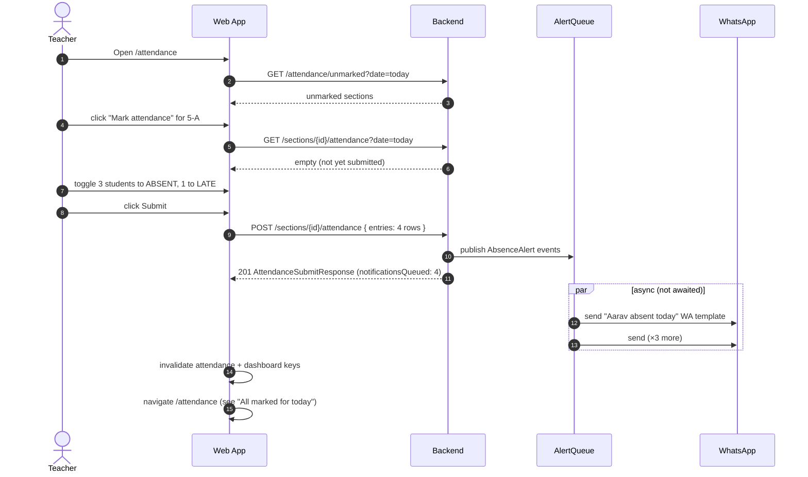
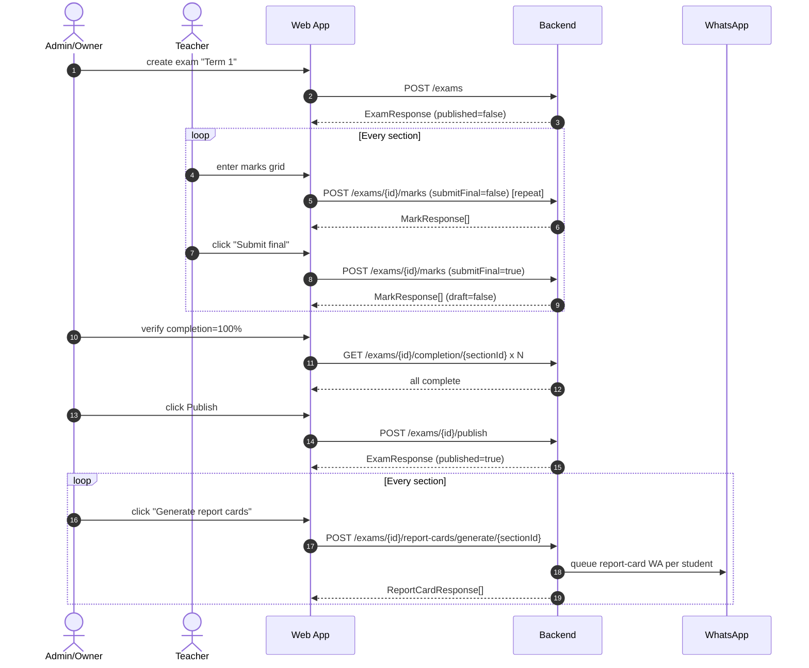
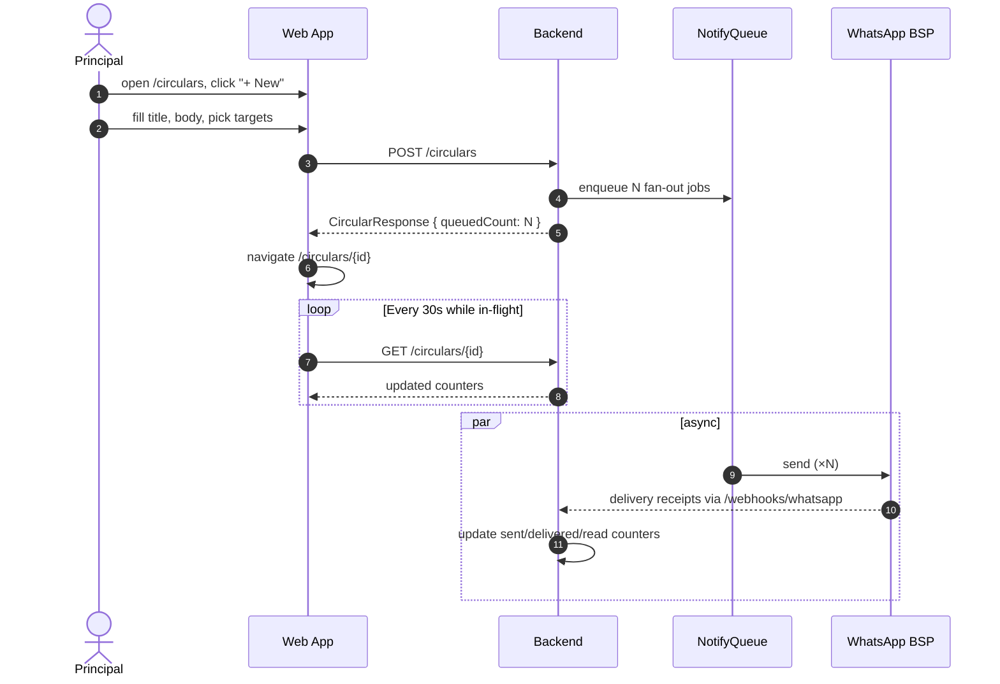
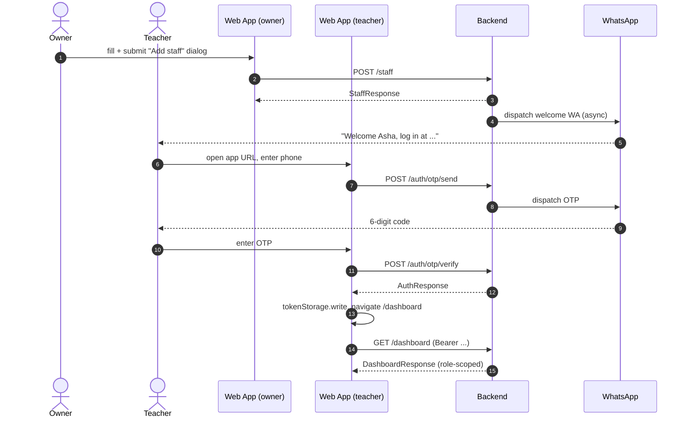

# 07 — Feature Flows

End-to-end user journeys for the 12 most important things the app does. Each flow names the page, the user action, the backend endpoint ([cross-linked to `02-api-reference.md`](02-api-reference.md)), the DTO on the wire ([cross-linked to `08-typescript-dto-reference.md`](08-typescript-dto-reference.md)), the role requirement ([`05-role-matrix.md`](05-role-matrix.md)), and the UI state transition.

These are **what should happen when the user clicks the button** — not UX copy, not visual design. If a flow isn't here, check [02-api-reference.md](02-api-reference.md) — if the endpoints don't exist, the flow shouldn't either.

**Cross-refs**: [01-auth-and-token-lifecycle.md](01-auth-and-token-lifecycle.md), [03-error-handling.md](03-error-handling.md), [04-multi-tenant-model.md](04-multi-tenant-model.md), [06-information-architecture.md](06-information-architecture.md), [09-data-fetching-patterns.md](09-data-fetching-patterns.md).

---

## Table of contents

1. [First-time signup + onboarding](#1-first-time-signup--onboarding)
2. [Daily attendance submission](#2-daily-attendance-submission)
3. [Quick-collect fee payment](#3-quick-collect-fee-payment)
4. [Online payment loop (defaulter → link → webhook → receipt)](#4-online-payment-loop)
5. [Marks entry + report card generation](#5-marks-entry--report-card-generation)
6. [Send a circular](#6-send-a-circular)
7. [Respond to an inbox message](#7-respond-to-an-inbox-message)
8. [Principal morning routine](#8-principal-morning-routine)
9. [Substitute teacher assignment](#9-substitute-teacher-assignment)
10. [Data export for auditor](#10-data-export-for-auditor)
11. [DPDP data-deletion request](#11-dpdp-data-deletion-request)
12. [Onboard a new teacher](#12-onboard-a-new-teacher)

---

## 1. First-time signup + onboarding

**Actor**: new principal (eventual role `PRINCIPAL`; initially no JWT).

**Precondition**: the principal has the app URL and their phone/email. The backend's `app.signup.channel` is configured (`PHONE`, `EMAIL`, or `BOTH`).

**Post-condition**: a tenant exists in the database, the principal is logged in, classes + sections are created, staff are added, the onboarding banner is gone.

**Related role**: signup itself is public; post-login actions require `OWNER_OR_ADMIN` per [05-role-matrix.md](05-role-matrix.md).

### Steps

| # | Page | Action | Endpoint | Request DTO | Response DTO | UI transition |
|---|---|---|---|---|---|---|
| 1 | `/signup` (`SignupPage`) | User fills school + principal fields, clicks "Create school" | [`POST /api/v1/tenants`](02-api-reference.md#post-apiv1tenants) | [`CreateSchoolRequest`](08-typescript-dto-reference.md#4-school-module) | [`SchoolSignupResponse`](08-typescript-dto-reference.md#4-school-module) | `sessionStorage` stashes `tenantId` + identifier; navigate `/signup/verify` |
| 2 | `/signup/verify` (`SignupVerifyPage`) | Page auto-sends an OTP | [`POST /api/v1/auth/otp/send`](02-api-reference.md#post-apiv1authotpsend) | [`SendOtpRequest`](08-typescript-dto-reference.md#3-auth-module) | `{ message: "OTP sent" }` | 6-digit input appears; toast "OTP sent to +91…" |
| 3 | same | User enters OTP, clicks "Verify" | [`POST /api/v1/auth/otp/verify`](02-api-reference.md#post-apiv1authotpverify) | [`VerifyOtpRequest`](08-typescript-dto-reference.md#3-auth-module) | [`AuthResponse`](08-typescript-dto-reference.md#3-auth-module) | `tokenStorage.write`, decode claims, navigate `/tenants/{tenantId}/dashboard` |
| 4 | `/tenants/:tenantId/dashboard` | `TenantLayout` fetches onboarding status on mount | [`GET …/onboarding-status`](02-api-reference.md#get-apiv1tenantstenantidonboarding-status) | — | [`OnboardingStatusResponse`](08-typescript-dto-reference.md#4-school-module) | `percentComplete < 100` → onboarding banner + checklist visible on `DashboardPage` |
| 5 | `/tenants/:tenantId/settings/school/classes` (`ClassesPage`) — from checklist CTA | User adds Class 1–10 with sections, clicks "Create" | [`POST …/classes/bulk`](02-api-reference.md#post-apiv1tenantstenantidclassesbulk) | [`CreateClassesRequest`](08-typescript-dto-reference.md#4-school-module) | [`ClassResponse[]`](08-typescript-dto-reference.md#4-school-module) | Invalidate `['classes', tenantId]` + `['onboarding-status', tenantId]`; toast "Classes created" |
| 6 | `/tenants/:tenantId/academics/subjects` (`SubjectsPage`) — from checklist | User lists subjects, clicks "Add subjects" | [`POST …/subjects/bulk`](02-api-reference.md#post-apiv1tenantstenantidsubjectsbulk) | [`CreateSubjectsRequest`](08-typescript-dto-reference.md#8-academics-module) | [`SubjectResponse[]`](08-typescript-dto-reference.md#8-academics-module) | Invalidate `['subjects', tenantId]` + `['onboarding-status', tenantId]` |
| 7 | `/tenants/:tenantId/settings/staff` (`StaffListPage`) — from checklist | User adds a teacher, clicks "Create" | [`POST …/staff`](02-api-reference.md#post-apiv1tenantstenantidstaff) | [`CreateStaffRequest`](08-typescript-dto-reference.md#4-school-module) | [`StaffResponse`](08-typescript-dto-reference.md#4-school-module) | Invalidate `['staff', tenantId]`; toast "Welcome SMS sent to Asha"; backend auto-dispatches the WA welcome message |
| 8 | `/tenants/:tenantId/academics/teacher-assignments` — from checklist | User picks (teacher × subject × section), clicks "Assign" | [`POST …/teacher-assignments`](02-api-reference.md#post-apiv1tenantstenantidteacher-assignments) | [`CreateTeacherAssignmentRequest`](08-typescript-dto-reference.md#8-academics-module) | [`TeacherAssignmentResponse`](08-typescript-dto-reference.md#8-academics-module) | Invalidate `['teacher-assignments', tenantId]` + `['onboarding-status', tenantId]` |
| 9 | any screen | `percentComplete === 100` on next onboarding-status refetch | — | — | — | Banner hides; checklist card disappears from `DashboardPage` |

Onboarding is **derived server-side** — there is no "mark onboarding complete" endpoint. `OnboardingService` recomputes `percentComplete` from the steps. Frontend just refetches after every mutation that could advance a step.

### Edge cases + error branches

- **Signup fails `VALIDATION_ERROR`** with `details.fieldErrors` — render inline on each form field. Example: `fieldErrors.phone = ["must match ..."]`.
- **Signup fails `VALIDATION_ERROR`** with no field errors (e.g. "Email already registered") — show a form-level banner.
- **OTP send returns `PHONE_NOT_FOUND`** — should not happen immediately after signup (the staff row exists). Treat as a backend bug; toast "Something went wrong — contact support."
- **OTP verify returns `OTP_INVALID`** — inline error under the OTP input. After too many attempts ("Request a new OTP"), reset to step 2.
- **OTP verify returns `OTP_EXPIRED`** — inline "Code expired. Send a new one?" — clicking resends via step 2.
- **`POST /classes/bulk` fails `VALIDATION_ERROR`** — map `details.fieldErrors.classes[i].sections` to the specific row + field.
- **Onboarding step click, user lacks role** — shouldn't happen for the signup principal (role is `PRINCIPAL`); for an `ADMIN` assistant, the checklist should hide non-allowed CTAs (`RequireRole`).

### Sequence (mermaid)

```mermaid
sequenceDiagram
    autonumber
    actor P as Principal
    participant UI as Web App
    participant API as Backend
    participant W as WhatsApp

    P->>UI: fill /signup form
    UI->>API: POST /api/v1/tenants
    API-->>UI: 201 SchoolSignupResponse
    UI->>UI: sessionStorage stash, navigate /signup/verify

    UI->>API: POST /api/v1/auth/otp/send
    API->>W: dispatch OTP
    API-->>UI: 200 { message }

    P->>UI: enter OTP
    UI->>API: POST /api/v1/auth/otp/verify
    API-->>UI: 200 AuthResponse
    UI->>UI: tokenStorage.write; navigate /tenants/{id}/dashboard

    UI->>API: GET /api/v1/tenants/{id}/onboarding-status
    API-->>UI: percentComplete=10

    loop Each onboarding step
        P->>UI: click checklist CTA
        UI->>API: POST /classes/bulk | /subjects/bulk | /staff | /teacher-assignments
        API-->>UI: 201
        UI->>API: GET /onboarding-status (invalidate)
        API-->>UI: percentComplete++
    end

    Note over UI: when percentComplete = 100, hide banner
```

---

## 2. Daily attendance submission

**Actor**: `CLASS_TEACHER` (also open to `SCHOOL_OWNER`, `PRINCIPAL`, `ADMIN` per [`ATTENDANCE_WRITER`](05-role-matrix.md)).

**Precondition**: teacher is logged in, a section is assigned to them, today's attendance has not been submitted yet (else `ATTENDANCE_ALREADY_SUBMITTED`).

**Post-condition**: attendance recorded for the date; async WhatsApp alerts queued to absent/late students' parents; `notificationsQueued` count in response.

### Steps

| # | Page | Action | Endpoint | Request | Response | UI transition |
|---|---|---|---|---|---|---|
| 1 | `/tenants/:tenantId/attendance` (`AttendanceHomePage`) | Page loads | [`GET …/attendance/unmarked?date=today`](02-api-reference.md#get-apiv1tenantstenantidattendanceunmarked) + [`GET …/attendance/summary?date=today`](02-api-reference.md#get-apiv1tenantstenantidattendancesummary) | — | [`UnmarkedSectionResponse[]`](08-typescript-dto-reference.md#6-attendance-module), [`AttendanceSummaryResponse`](08-typescript-dto-reference.md#6-attendance-module) | "Unmarked" card lists the teacher's sections |
| 2 | same | Teacher clicks "Mark attendance" on their section | — (client-side navigate) | — | — | Navigate `/tenants/:tenantId/attendance/section/:sectionId?date=YYYY-MM-DD` |
| 3 | `/tenants/:tenantId/attendance/section/:sectionId` (`AttendanceGridPage`) | Page loads | [`GET …/sections/{sectionId}/attendance?date=`](02-api-reference.md#get-apiv1tenantstenantidsectionssectionidattendance) + [`GET …/students?size=1000`](02-api-reference.md#get-apiv1tenantstenantidstudents) (scoped to section) | — | [`AttendanceRecordResponse[]`](08-typescript-dto-reference.md#6-attendance-module), [`StudentResponse[]`](08-typescript-dto-reference.md#5-student-module) | Grid renders: all students default to PRESENT |
| 4 | same | Teacher toggles status on non-PRESENT rows, optionally adds notes | — | — | — | Local form state (`react-hook-form`) |
| 5 | same | Teacher clicks "Submit" | [`POST …/sections/{sectionId}/attendance`](02-api-reference.md#post-apiv1tenantstenantidsectionssectionidattendance) | [`SubmitAttendanceRequest`](08-typescript-dto-reference.md#6-attendance-module) — only non-PRESENT rows | [`AttendanceSubmitResponse`](08-typescript-dto-reference.md#6-attendance-module) | Toast "Submitted. 3 parents being notified via WhatsApp"; invalidate `['attendance', tenantId, sectionId, date]` + `['attendance-summary', tenantId, date]` + `['attendance-unmarked', tenantId, date]` + `['dashboard', tenantId]`; navigate `/tenants/:tenantId/attendance` |

**Reverse-marking rule**: the client sends **only** students whose status is `ABSENT | LATE | HALF_DAY | LEAVE`. The server implicitly marks everyone else `PRESENT`. Don't send `PRESENT` rows — it's wasted bandwidth and the server accepts both shapes, but the server-side logic is cleaner when absent.

### Edge cases + error branches

- **`ATTENDANCE_ALREADY_SUBMITTED` (409)** — the banner at the top of `AttendanceGridPage` says "Today's attendance was already submitted by <teacher>." The submit button is hidden; the grid becomes read-only.
- **`SECTION_NOT_ASSIGNED` (403)** — `CLASS_TEACHER` tried to submit for a section that isn't theirs. Navigate to `/access-denied`.
- **`VALIDATION_ERROR`** — per-row field errors on `entries[i].arrivalTime` or similar. Render inline on the row.
- **Date picker picks a future date** — backend rejects (`@PastOrPresent` on `date`). Disable future dates in the picker.
- **Duplicate `studentId` in `entries`** — Bean Validation may not catch this; de-duplicate client-side before submit.
- **Network failure mid-submit** — `useSubmitAttendanceMutation` retries twice (see [09-data-fetching-patterns.md](09-data-fetching-patterns.md)); if still failing, toast with retry button.

### Sequence



---

## 3. Quick-collect fee payment

**Actor**: `ACCOUNTANT` (also `SCHOOL_OWNER`, `PRINCIPAL`, `ADMIN` per [`FEE_WRITER`](05-role-matrix.md)).

**Precondition**: student exists in the tenant; has one or more pending invoices *or* an opening balance (or the accountant is accepting an advance).

**Post-condition**: a `Payment` row with a receipt number + PDF URL is created. Receipt sent via WhatsApp to the parent's phone. Student's outstanding balance decremented.

### Steps

| # | Page | Action | Endpoint | Request | Response | UI transition |
|---|---|---|---|---|---|---|
| 1 | `/tenants/:tenantId/fees/collect` (`QuickCollectPage`) | Accountant types student name in the search field | [`GET …/students?search=X&size=10`](02-api-reference.md#get-apiv1tenantstenantidstudents) | — | `StudentResponse[]` | Debounced dropdown |
| 2 | same | Picks a student | [`GET …/students/{studentId}/fee-summary`](02-api-reference.md#get-apiv1tenantstenantidstudentsstudentidfee-summary) | — | [`StudentFeeSummaryResponse`](08-typescript-dto-reference.md#7-fee-module) | Side panel shows `totalOutstandingPaise`, pending invoices |
| 3 | same | Enters amount + mode (CASH/ONLINE/CHEQUE/DD/BANK_TRANSFER), optional `invoiceId`, optional notes | — | — | — | Local form state |
| 4 | same | Clicks "Collect" | [`POST …/fees/payments`](02-api-reference.md#post-apiv1tenantstenantidfeespayments) | [`QuickCollectRequest`](08-typescript-dto-reference.md#7-fee-module) | [`PaymentResponse`](08-typescript-dto-reference.md#7-fee-module) | Success panel shows `receiptNumber`, `receiptPdfUrl` embed, "Sent to WhatsApp" badge |
| 5 | same | Clicks "Another payment" | — | — | — | Reset form, focus the search input |

Invalidations after step 4: `['student-fee-summary', tenantId, studentId]`, `['fee-dashboard', tenantId]`, `['fee-defaulters', tenantId]`, `['student', tenantId, studentId]`, `['dashboard', tenantId]`.

### Edge cases + error branches

- **`STUDENT_NOT_FOUND` (404)** — the search picked a stale cached id. Toast "Student no longer exists. Refresh."
- **`PAYMENT_AMOUNT_EXCEEDS_DUE` (400)** — the amount is greater than the single invoice's balance. Two handling options:
  - If `invoiceId` was provided → inline error under the amount field. Accountant adjusts.
  - If `invoiceId` was null → shouldn't fire (FIFO distributes); treat as backend bug.
- **`INVOICE_NOT_FOUND` (404)** — `invoiceId` points to a waived / stale invoice. Clear `invoiceId`, refetch summary.
- **`VALIDATION_ERROR`** — `amountPaise <= 0`, missing `paymentMode`. Inline.
- **WhatsApp send failure** — backend queues asynchronously; the payment still succeeds. The WhatsApp retry queue handles it; UI sees `PaymentResponse.receiptPdfUrl` regardless.
- **Receipt PDF not yet generated** — `receiptPdfUrl` may be null if the PDF render is async-queued. The UI shows "Receipt being prepared…" and polls `GET /fees/payments/{paymentId}` every 2s until `receiptPdfUrl` is present (max 15s).

---

## 4. Online payment loop

**Actor**: `PRINCIPAL` (trigger) + parent (pays) + `SCHOOL_OWNER` (audits).

**Precondition**: fee reminder schedules configured with `includeUpiLink = true`; Stripe/Razorpay configured server-side (`app.payment.provider`).

**Post-condition**: parent pays; webhook records the payment server-side; receipt auto-sent via WhatsApp; UI reflects zero (or reduced) outstanding balance.

### Steps

| # | Actor | Page / System | Action | Endpoint | Notes |
|---|---|---|---|---|---|
| 1 | Principal | `/tenants/:tenantId/fees/defaulters` (`DefaultersListPage`) | Selects one or more defaulters, clicks "Send reminders" | [`POST …/fees/reminders`](02-api-reference.md#post-apiv1tenantstenantidfeesreminders) with [`BulkReminderRequest`](08-typescript-dto-reference.md#7-fee-module) | Response: `{ queued: N }`. Toast "N reminders queued." |
| 2 | Backend | WhatsApp queue | Sends a templated message with a payment link (Stripe Checkout or Razorpay payment-link) | — | Parent phone from `Parent.phone` — server-side only, UI never handles raw parent phones |
| 3 | Parent | WhatsApp | Taps payment link → pays on Stripe/Razorpay | — | — |
| 4 | Provider → Backend | [`POST /webhooks/stripe`](02-api-reference.md#post-webhooksstripe) or [`POST /webhooks/razorpay`](02-api-reference.md#post-webhooksrazorpay) | HMAC-verified; publishes `PaymentEvent` internally | — | Public endpoint, HMAC header required |
| 5 | Backend | Event listener | Creates `Payment` row, generates receipt PDF, queues WhatsApp receipt | — | Same pipeline as a manual quick-collect |
| 6 | Principal | `DashboardPage` | Auto-refreshes (staleTime 60s) | [`GET …/fees/dashboard`](02-api-reference.md#get-apiv1tenantstenantidfeesdashboard) | `collectedTodayPaise` + `collectedThisMonthPaise` reflect the payment |

**Frontend does not poll for webhook completion.** Rely on the 60-second `staleTime` on the dashboard and fee pages, or a manual refresh. If we later add a server-sent events stream for live payments, this flow gets a step 7.

### Edge cases + error branches

- **`POST /fees/reminders` → `VALIDATION_ERROR`** — `studentIds` empty or over the server's cap. Inline.
- **Webhook replay / duplicate** — backend dedupes by provider event id (`idempotency_key`). No frontend concern.
- **Payment refunded** — the provider fires `charge.refunded` / `refund.created`. Backend marks the payment refunded; an alert appears on `AlertsListPage`. The UI should display "(refunded)" next to the payment on `StudentFeeSummaryPage` — read from `PaymentResponse.outstandingBalancePaise` returning to the pre-payment value.
- **`POST /fees/reminders` → `TEMPLATE_NOT_APPROVED`** — WA template for reminders hasn't been approved by the BSP. Surface as a toast with a link to the setup guide.

### Sequence

```mermaid
sequenceDiagram
    autonumber
    actor Pr as Principal
    participant UI as Web App
    participant API as Backend
    participant Q as AlertQueue
    participant W as WhatsApp BSP
    actor Pa as Parent
    participant Sp as Stripe/Razorpay

    Pr->>UI: select defaulters, click "Send reminders"
    UI->>API: POST /fees/reminders
    API->>Q: enqueue N reminder jobs
    API-->>UI: { queued: N }

    Q->>W: send templated WA with payment link
    W-->>Pa: message

    Pa->>Sp: taps link, pays
    Sp-->>API: POST /webhooks/stripe (or razorpay)
    API->>API: record Payment + publish PaymentEvent
    API->>Q: enqueue receipt WA
    Q->>W: receipt WA
    W-->>Pa: receipt PDF

    Note over UI,API: Dashboard staleTime=60s triggers refetch;<br>principal sees collection totals updated
```

---

## 5. Marks entry + report card generation

**Actors**:
- `OWNER_OR_ADMIN` (creates + publishes the exam, generates report cards)
- `MARKS_WRITER` — `CLASS_TEACHER` / `SUBJECT_TEACHER` / owner / principal / admin (enters marks)

**Precondition**: academic year is active, subjects exist, teacher assignments exist, students are enrolled.

**Post-condition**: exam is published, report-card PDFs are generated + sent to parents via WhatsApp.

### Steps

| # | Actor | Page | Action | Endpoint | Request | Response | UI transition |
|---|---|---|---|---|---|---|---|
| 1 | Owner/Admin | `/tenants/:tenantId/academics/exams` (`ExamsListPage`) | Clicks "+ New exam", fills name/type/dates, submits | [`POST …/exams`](02-api-reference.md#post-apiv1tenantstenantidexams) | [`CreateExamRequest`](08-typescript-dto-reference.md#8-academics-module) | [`ExamResponse`](08-typescript-dto-reference.md#8-academics-module) (`published=false`) | Invalidate `['exams', tenantId]`; dialog closes |
| 2 | Teacher | `/tenants/:tenantId/academics/exams/:examId/marks/:sectionId` (`MarksEntryPage`) | Page loads | [`GET …/exams/{examId}/marks/{sectionId}`](02-api-reference.md#get-apiv1tenantstenantidexamsexamidmarkssectionid) + [`GET …/exams/{examId}/completion/{sectionId}`](02-api-reference.md#get-apiv1tenantstenantidexamsexamidcompletionsectionid) | — | [`MarksEntrySheetResponse`](08-typescript-dto-reference.md#8-academics-module), [`ExamCompletionStatusResponse`](08-typescript-dto-reference.md#8-academics-module) | Grid: rows = students × columns = teacher's assigned subjects; existing marks prefilled |
| 3 | Teacher | same | Enters marks row-by-row (or pastes a column) | — | — | — | Form state (`react-hook-form` with `useFieldArray`) |
| 4 | Teacher | same | Clicks "Save draft" | [`POST …/exams/{examId}/marks`](02-api-reference.md#post-apiv1tenantstenantidexamsexamidmarks) with `submitFinal=false` | [`BulkMarksRequest`](08-typescript-dto-reference.md#8-academics-module) | [`MarkResponse[]`](08-typescript-dto-reference.md#8-academics-module) | Toast "Draft saved"; invalidate `['marks-sheet', tenantId, examId, sectionId]` + `['exam-completion', tenantId, examId, sectionId]` |
| 5 | Teacher | same | Clicks "Submit final" | [`POST …/exams/{examId}/marks`](02-api-reference.md#post-apiv1tenantstenantidexamsexamidmarks) with `submitFinal=true` | Same | Same | Toast "Marks finalised"; marks become read-only for this teacher's subject scope |
| 6 | Owner/Admin | `/tenants/:tenantId/academics/exams/:examId` (`ExamDetailPage`) | Verifies all sections' completion = 100%, clicks "Publish exam" | [`POST …/exams/{examId}/publish`](02-api-reference.md#post-apiv1tenantstenantidexamsexamidpublish) | — | [`ExamResponse`](08-typescript-dto-reference.md#8-academics-module) (`published=true`) | Toast "Published. Now generate report cards."; all marks become read-only |
| 7 | Owner/Admin | `/tenants/:tenantId/academics/exams/:examId/report-cards/:sectionId` (`ReportCardGeneratePage`) | Clicks "Generate report cards" for each section | [`POST …/exams/{examId}/report-cards/generate/{sectionId}`](02-api-reference.md#post-apiv1tenantstenantidexamsexamidreport-cardsgeneratesectionid) | — | [`ReportCardResponse[]`](08-typescript-dto-reference.md#8-academics-module) | Per-student progress table; `pdfUrl` + `waSentAt` appear as rows complete |

### Edge cases + error branches

- **`MARKS_ALREADY_FINALIZED` (409)** on step 4/5 — exam is already published; grid becomes read-only; show a banner "Exam is published — marks cannot be edited."
- **`MAX_MARKS_EXCEEDED` (400)** — a row's `obtainedMarks > maxMarks`. Inline error on the row.
- **`VALIDATION_ERROR`** — negative marks, non-numeric, missing required. Inline.
- **`SECTION_NOT_ASSIGNED` (403)** — a `SUBJECT_TEACHER` tried to submit for a section they aren't assigned to teach. Route to `/access-denied`.
- **`EXAM_NOT_FOUND` (404)** — stale link. Navigate back to `ExamsListPage`.
- **`REPORT_CARD_NOT_READY` (409)** on step 7 — sections still have unfilled marks. Show "Section X has Y subjects pending" based on the completion query.
- **Publish with incomplete marks** — backend allows publishing but report-card generation will fail — surface the completion tally before enabling "Publish" (hint: show "All sections complete" / "Sections X, Y pending").

### Sequence



---

## 6. Send a circular

**Actor**: `OWNER_OR_ADMIN`.

**Precondition**: WA templates approved (`app.whatsapp.*`); target classes/sections/students exist.

**Post-condition**: circular persisted; WA fan-out queued; delivery counters tick up over minutes.

### Steps

| # | Page | Action | Endpoint | Request | Response | UI transition |
|---|---|---|---|---|---|---|
| 1 | `/tenants/:tenantId/circulars` (`CircularsListPage`) | Clicks "+ New circular" | — | — | — | Dialog opens |
| 2 | Compose dialog | Types title + body, picks `targetType` (`ALL_PARENTS`/`CLASSES`/`SECTIONS`/`STUDENTS`), picks target ids if applicable | — | — | — | Client validates body ≤ 4000 chars |
| 3 | same | Clicks "Send" | [`POST …/circulars`](02-api-reference.md#post-apiv1tenantstenantidcirculars) | [`CreateCircularRequest`](08-typescript-dto-reference.md#11-communication-module) | [`CircularResponse`](08-typescript-dto-reference.md#11-communication-module) | Dialog closes; toast "Queued for N parents"; invalidate `['circulars', tenantId]`; navigate to `/tenants/:tenantId/circulars/:id` |
| 4 | `/tenants/:tenantId/circulars/:id` (`CircularDetailPage`) | Page polls every 30s while fan-out is in progress | [`GET …/circulars/{id}`](02-api-reference.md#get-apiv1tenantstenantidcircularsid) | — | `CircularResponse` with updated `queuedCount`, `sentCount`, `deliveredCount`, `failedCount` | Progress bar animates |

### Edge cases + error branches

- **`VALIDATION_ERROR`** — title > 255 chars, body > 4000 chars, or `targetType=CLASSES` with empty `targetIds`. Inline on each field.
- **`TEMPLATE_NOT_APPROVED`** — WA template not approved for the chosen language. Toast "Language 'hi' template not approved by WhatsApp yet."
- **`WHATSAPP_SEND_FAILED`** — per-parent failure surfaces in `failedCount`, not as a blocking error on send. Inspect individual failures via audit log if needed.
- **Reversibility** — circulars are immutable after send. No delete/edit endpoint. Warn the user in the dialog.

### Sequence



---

## 7. Respond to an inbox message

**Actor**: `CLASS_TEACHER` (and `SUBJECT_TEACHER`, owner, principal, admin per [`ANY_TEACHER`](05-role-matrix.md)).

**Precondition**: a parent replied to an outbound WA (via [`POST /webhooks/whatsapp`](02-api-reference.md#post-webhookswhatsapp)); inbox router matched the phone to a parent and routed the message to the appropriate class teacher.

**Post-condition**: message marked read + resolved; unread-count badge drops.

**Note**: the web admin **does not send outbound replies** — parents are contacted via circulars or out-of-band by the teacher's own phone. The only "respond" actions are `read` / `resolve` / (for principals) `reassign`.

### Steps

| # | Page | Action | Endpoint | Request | Response | UI transition |
|---|---|---|---|---|---|---|
| 1 | Any page | Topbar inbox badge shows unread count | [`GET …/inbox/mine/unread-count`](02-api-reference.md#get-apiv1tenantstenantidinboxmineunread-count), polled 60s | — | `{ unread: N }` | Badge updates |
| 2 | `/tenants/:tenantId/inbox/mine` (`MyInboxPage`) | Teacher opens inbox | [`GET …/inbox/mine?page=0&size=50`](02-api-reference.md#get-apiv1tenantstenantidinboxmine) | — | [`InboxMessageResponse[]`](08-typescript-dto-reference.md#11-communication-module) (paginated) | List renders; phones masked |
| 3 | same | Clicks a row to expand | — | — | — | Row shows full body + metadata |
| 4 | same | Clicks "Mark read" (optimistic) | [`POST …/inbox/{messageId}/read`](02-api-reference.md#post-apiv1tenantstenantidinboxmessageidread) | — | `InboxMessageResponse` | Row styled as read; badge decrements |
| 5 | same | After action (phone call, meeting, etc.), clicks "Mark resolved" | [`POST …/inbox/{messageId}/resolve`](02-api-reference.md#post-apiv1tenantstenantidinboxmessageidresolve) | — | `InboxMessageResponse` | Row removed from active view (still visible via "Show resolved" toggle) |

### Principal reassignment variant

| # | Page | Action | Endpoint | Notes |
|---|---|---|---|---|
| 1' | `/tenants/:tenantId/inbox/unrouted` (`UnroutedInboxPage`) | Principal sees a message the router couldn't match | [`GET …/inbox/unrouted`](02-api-reference.md#get-apiv1tenantstenantidinboxunrouted) | |
| 2' | same | Clicks "Reassign" → picks a teacher | [`POST …/inbox/{messageId}/reassign?toTeacherId=…`](02-api-reference.md#post-apiv1tenantstenantidinboxmessageidreassign) | Teacher's inbox count ticks up |

### Edge cases + error branches

- **`RESOURCE_NOT_FOUND`** — message already resolved by another teacher (e.g. a co-teacher marked it). Refetch `mine`.
- **Optimistic read failure** — `useMarkReadMutation` rolls back `read=true` and re-increments the badge (see [09-data-fetching-patterns.md §Optimistic updates](09-data-fetching-patterns.md)).
- **Reassign target lacks `ANY_TEACHER`** — server returns `VALIDATION_ERROR`. Toast "That user can't be assigned to inbox messages."

---

## 8. Principal morning routine

**Actor**: `PRINCIPAL` (and `SCHOOL_OWNER`, `ADMIN`).

**Precondition**: any business day after alert + digest job ran (typically 7 AM server-side).

**Post-condition**: principal has triaged the day's alerts; dismissed resolved ones; drilled into chronic-absentee cases.

### Steps

| # | Page | Action | Endpoint | Response | UI transition |
|---|---|---|---|---|---|
| 1 | `/tenants/:tenantId/dashboard` (`DashboardPage`) | Principal logs in, lands here | [`GET …/dashboard`](02-api-reference.md#get-apiv1tenantstenantiddashboard) | [`DashboardResponse`](08-typescript-dto-reference.md#9-analytics-module) | Tiles: attendance, alert counts, fee MTD, unmarked sections, top at-risk students |
| 2 | same | Dashboard also fetches alert summary for the high/critical tile | [`GET …/alerts?severity=HIGH&severity=CRITICAL`](02-api-reference.md#get-alerts) | [`AlertResponse[]`](08-typescript-dto-reference.md#9-analytics-module) | Filtered list tile on right |
| 3 | same | Sees "Unmarked sections: 2" tile | [`GET …/attendance/unmarked?date=today`](02-api-reference.md#get-apiv1tenantstenantidattendanceunmarked) | [`UnmarkedSectionResponse[]`](08-typescript-dto-reference.md#6-attendance-module) | Tile links to full list |
| 4 | same | Clicks "Class 10-A attendance not submitted" alert row | — | — | Navigate to `/tenants/:tenantId/attendance/section/:sectionId` |
| 5 | `/tenants/:tenantId/attendance/chronic` (via Analytics → Attendance quick link) | Opens chronic absentees list | [`GET …/attendance/chronic?windowDays=30&minAbsences=5`](02-api-reference.md#get-apiv1tenantstenantidattendancechronic) | [`ChronicAbsenteeResponse[]`](08-typescript-dto-reference.md#6-attendance-module) | Grid; each row links to the student |
| 6 | Dashboard | Clicks "Dismiss" on a resolved alert | [`POST …/alerts/{alertId}/dismiss`](02-api-reference.md#post-alertsalertiddismiss) | [`AlertResponse`](08-typescript-dto-reference.md#9-analytics-module) (`dismissed=true`) | Optimistic remove from list; refetch counters |

### Edge cases + error branches

- **`FORBIDDEN` on dismiss** — the logged-in user isn't `OWNER_OR_ADMIN`. Button should have been hidden via `RequireRole`; if it fired, toast "You don't have permission to dismiss alerts."
- **`RESOURCE_NOT_FOUND` on dismiss** — alert expired / already dismissed. Just refetch.
- **Dashboard stale** — `staleTime=60s`. User can pull-to-refresh (or F5) or `queryClient.invalidateQueries({ queryKey: ['dashboard', tenantId] })`.
- **At-risk tile is empty** — show "No students currently flagged — attendance and fees are on track."

---

## 9. Substitute teacher assignment

**Actor**: `OWNER_OR_ADMIN`.

**Precondition**: absent teacher exists, target section exists, a substitute staff member exists.

**Post-condition**: substitute assignment persisted for the date; server-side WhatsApp notification dispatched to the substitute.

### Steps

| # | Page | Action | Endpoint | Request | Response | UI transition |
|---|---|---|---|---|---|---|
| 1 | `/tenants/:tenantId/settings/substitutes` (`SubstitutesPage`) | Principal opens for today | [`GET …/substitutes?date=today`](02-api-reference.md#get-apiv1tenantstenantidsubstitutes) | — | [`SubstituteResponse[]`](08-typescript-dto-reference.md#4-school-module) | Empty state: "No substitutes today" |
| 2 | same | Clicks "+ Assign substitute" | — | — | — | Dialog opens |
| 3 | Dialog | Picks absent teacher, substitute, section, date, adds note | — | — | — | Form state |
| 4 | same | Clicks "Assign" | [`POST …/substitutes`](02-api-reference.md#post-apiv1tenantstenantidsubstitutes) | [`CreateSubstituteRequest`](08-typescript-dto-reference.md#4-school-module) | [`SubstituteResponse`](08-typescript-dto-reference.md#4-school-module) | Invalidate `['substitutes', tenantId, date]`; toast "Substitute notified via WhatsApp" |
| 5 | `/tenants/:tenantId/settings/substitutes` | Row appears in the table | — | — | — | Cancel action available |

### Cancel variant

Row "Cancel" → confirmation dialog → [`DELETE …/substitutes/{id}`](02-api-reference.md#delete-apiv1tenantstenantidsubstitutesid) → toast "Cancelled" → invalidate.

### Edge cases + error branches

- **`SECTION_NOT_FOUND`** — section was deleted after being selected. Refetch classes; clear the field.
- **`VALIDATION_ERROR`** — `absentTeacherId == substituteId` (self-sub), `assignedDate` in the past by > N days (backend policy may vary). Inline.
- **Substitute is themselves absent today** — backend doesn't enforce this; principal should be aware. (Future UX: warn client-side if the chosen substitute is already in another assignment on the same date.)
- **WhatsApp send to substitute fails** — backend queues; retry silently; does not block the assignment save.

---

## 10. Data export for auditor

**Actor**: `OWNER_OR_ADMIN` (students + attendance) or `FEE_WRITER` (fees).

**Precondition**: data exists for the requested window.

**Post-condition**: XLSX/CSV file downloaded; audit-log row written (server-side); file not persisted on server beyond the request.

### Steps

| # | Page | Action | Endpoint | Response | UI transition |
|---|---|---|---|---|---|
| 1 | `/tenants/:tenantId/settings/exports` (`ExportsPage`) | Admin picks "Fees", format XLSX, date range (for attendance only) | — | — | Form state |
| 2 | same | Clicks "Download" | [`GET …/export/fees?format=XLSX`](02-api-reference.md#get-apiv1tenantstenantidexportfees) (or `/export/students`, `/export/attendance`) | Raw bytes, `application/vnd.openxmlformats…` | Browser download via blob (see [09-data-fetching-patterns.md §Streaming downloads](09-data-fetching-patterns.md)) |
| 3 | Backend (side effect) | Writes an audit-log row: `entityType=EXPORT, action=ACTION, changedByRole=…` | — | — | — |
| 4 | `/tenants/:tenantId/settings/audit` (`AuditLogPage`) — principal/owner can verify | Filters by `entityType=EXPORT` | [`GET …/audit?entityType=EXPORT`](02-api-reference.md#get-audit) | [`AuditLogResponse[]`](08-typescript-dto-reference.md#10-audit-module) | Row visible; `newValues` includes the export type + row count |

### Edge cases + error branches

- **`VALIDATION_ERROR`** on attendance export — `from > to`. Inline on the date picker.
- **`FORBIDDEN`** — the hit role doesn't match the endpoint's requirement (e.g. `ACCOUNTANT` tries `/export/students`). Button should be hidden; if fired, toast "You don't have permission."
- **Large export times out** — backend streams, so timeout is on the axios side; set `responseType: 'blob'` with no timeout (see [09-data-fetching-patterns.md](09-data-fetching-patterns.md)).
- **Empty data** — the file downloads with just headers. No special handling.

### Download pattern (bypasses react-query)

```ts
// src/features/exports/download.ts
export async function downloadExport(url: string, filename: string) {
  const token = tokenStorage.read()?.accessToken;
  const res = await fetch(`${import.meta.env.VITE_API_BASE_URL}${url}`, {
    headers: { Authorization: `Bearer ${token}` },
  });
  if (!res.ok) throw await ApiError.fromResponse(res);
  const blob = await res.blob();
  const href = URL.createObjectURL(blob);
  const a = Object.assign(document.createElement('a'), { href, download: filename });
  a.click();
  URL.revokeObjectURL(href);
}
```

Full details in [09-data-fetching-patterns.md §Streaming downloads](09-data-fetching-patterns.md).

---

## 11. DPDP data-deletion request

**Actor**: `SCHOOL_OWNER` or `PRINCIPAL` (explicitly **not** `ADMIN`).

**Precondition**: the subject (student/parent/staff) exists.

**Post-condition**: a deletion-request row is persisted; audit-log row written; **no data is deleted inline** — this triggers a compliance workflow that runs off-app.

### Steps

| # | Page | Action | Endpoint | Request | Response | UI transition |
|---|---|---|---|---|---|---|
| 1 | `/tenants/:tenantId/settings/data-privacy` (`DataPrivacyPage`) | Principal clicks "+ New deletion request" | — | — | — | Dialog opens |
| 2 | Dialog | Picks `subjectType` (`STUDENT`/`PARENT`/`STAFF`), enters `subjectId` (or uses a picker), enters `reason` | — | — | — | Form state |
| 3 | same | Clicks "File request" with an "I understand this is irreversible for the compliance team" checkbox | [`POST …/data-deletion-requests`](02-api-reference.md#post-data-deletion-requests) | [`DataDeletionRequestBody`](08-typescript-dto-reference.md#10-audit-module) | `202 Accepted` + [`DataDeletionResponse`](08-typescript-dto-reference.md#10-audit-module) | Dialog closes; toast "Request logged. Compliance team will follow up within 30 days." |
| 4 | `/tenants/:tenantId/settings/audit` | Principal verifies the audit row | [`GET …/audit?entityType=DATA_DELETION_REQUEST&entityId=<requestId>`](02-api-reference.md#get-audit) | [`AuditLogResponse[]`](08-typescript-dto-reference.md#10-audit-module) | Single-row timeline |

### Edge cases + error branches

- **`VALIDATION_ERROR`** — invalid `subjectType`, invalid UUID. Inline.
- **`FORBIDDEN`** — `ADMIN` or below tried. Button should be hidden; if fired, toast "Only the school owner or principal can file deletion requests."
- **Request is duplicate** — backend doesn't dedupe in Phase 1. The compliance team will consolidate off-app.
- **Compliance already closed the ticket** — no state machine on the frontend for that; `DataDeletionResponse.status` is always `RECORDED` at file time.

---

## 12. Onboard a new teacher

**Actor** (trigger): `OWNER_OR_ADMIN`. **Actor** (landing): new teacher (`CLASS_TEACHER` / `SUBJECT_TEACHER` / `ACCOUNTANT` / `ADMIN`).

**Precondition**: owner has the teacher's phone and role decided.

**Post-condition**: staff row created; WA welcome dispatched; teacher logs in via OTP and lands on their scoped view.

### Steps

| # | Actor | Page | Action | Endpoint | Request | Response | UI transition |
|---|---|---|---|---|---|---|---|
| 1 | Owner | `/tenants/:tenantId/settings/staff` (`StaffListPage`) | Clicks "+ Add staff" | — | — | — | Dialog opens |
| 2 | Owner | Dialog | Fills first/last name, phone, email, role | — | — | — | Form state |
| 3 | Owner | same | Clicks "Create" | [`POST …/staff`](02-api-reference.md#post-apiv1tenantstenantidstaff) | [`CreateStaffRequest`](08-typescript-dto-reference.md#4-school-module) | [`StaffResponse`](08-typescript-dto-reference.md#4-school-module) | Dialog closes; toast "Welcome WhatsApp sent to Asha"; invalidate `['staff', tenantId]` |
| 4 | Backend | (side effect) | Dispatches WA welcome with the app URL | — | — | — | — |
| 5 | New teacher | `/login` | Receives welcome WA, opens the app URL, enters phone | [`POST /api/v1/auth/otp/send`](02-api-reference.md#post-apiv1authotpsend) | [`SendOtpRequest`](08-typescript-dto-reference.md#3-auth-module) | `{ message }` | OTP input |
| 6 | New teacher | same | Enters OTP | [`POST /api/v1/auth/otp/verify`](02-api-reference.md#post-apiv1authotpverify) | [`VerifyOtpRequest`](08-typescript-dto-reference.md#3-auth-module) | [`AuthResponse`](08-typescript-dto-reference.md#3-auth-module) | `tokenStorage.write`, navigate `/tenants/{tenantId}/dashboard` |
| 7 | New teacher | `/tenants/:tenantId/dashboard` | Landing page renders; sidebar is role-gated | [`GET …/dashboard`](02-api-reference.md#get-apiv1tenantstenantiddashboard) | [`DashboardResponse`](08-typescript-dto-reference.md#9-analytics-module) | `CLASS_TEACHER`: sees Dashboard, Students, Attendance, Academics, Communication, Analytics; Fees + Staff + Settings hidden. `ACCOUNTANT`: sees Dashboard, Students, Attendance, Fees, Analytics; Academics + Communication + Staff + Settings hidden. |

### Teacher next actions

Once landed, the teacher's own workflows:

- **Class teacher** — typical first action: mark today's attendance (flow #2).
- **Subject teacher** — wait for the admin to create an exam and enter marks (flow #5).
- **Accountant** — quick-collect fees (flow #3).

### Edge cases + error branches

- **`VALIDATION_ERROR`** on create — bad phone, missing role. Inline.
- **`INVALID_PHONE`** — inline on the phone field. The server message is specific — use it.
- **Duplicate phone across the tenant** — `VALIDATION_ERROR` with `fieldErrors.phone = ["already registered"]`. Inline.
- **WA welcome fails** — backend queues + retries; not user-visible. Teacher may need to learn the URL out-of-band.
- **Teacher tries `PHONE_NOT_FOUND`** at OTP send — the staff row may have been deactivated in the 60s between creation and login. Refresh + try again.
- **Teacher is deactivated** — refresh token flow returns `UNAUTHORIZED` ("Account no longer active"); redirect to `/login`.

### Sequence



---

## 13. Bonus: migration review + commit (OCR paper-register import)

**Actor**: `OWNER_OR_ADMIN`.

**Precondition**: school has a stack of paper records (fee registers, attendance sheets, marks sheets, admission forms) they want to digitise.

**Post-condition**: the reviewed rows are committed as historical entities (invoices, attendance records, marks, or students); audit log shows one row per job; job transitions `UPLOADED → EXTRACTING → REVIEW → COMMITTED`.

### Steps

| # | Page | Action | Endpoint | Request | Response | UI transition |
|---|---|---|---|---|---|---|
| 1 | `/tenants/:tenantId/settings/migration` (`MigrationJobsPage`) | Clicks "+ Upload scan" | — | — | — | Dialog opens |
| 2 | Dialog | Picks `type` (`FEE_RECEIPT`/`ATTENDANCE`/`MARKS`/`ADMISSION_FORM`) + image/PDF | [`POST …/migration`](02-api-reference.md#post-apiv1tenantstenantidmigration) | `multipart/form-data` with `type` + `file` | [`MigrationJobResponse`](02-api-reference.md#post-apiv1tenantstenantidmigration) (`status=UPLOADED`) | Dialog closes; toast "Uploaded, processing…" |
| 3 | `/tenants/:tenantId/settings/migration/:jobId` (`MigrationReviewPage`) | Page polls while `status ∈ {UPLOADED, EXTRACTING}` | [`GET …/migration/{jobId}`](02-api-reference.md#get-apiv1tenantstenantidmigrationjobid) every 5s | — | `MigrationJobResponse` | Spinner with the current status |
| 4 | same | Status flips to `REVIEW`; page renders the `reviewableRecords` table | — | — | `MigrationJobResponse` with `reviewableRecords` populated | Per-row: accept / edit / reject |
| 5 | same | User tweaks mis-OCR'd fields, toggles rows to accept | — | — | — | Local form state |
| 6 | same | Clicks "Commit accepted rows" | [`POST …/migration/{jobId}/commit`](02-api-reference.md#post-apiv1tenantstenantidmigrationjobidcommit) | [`CommitMigrationRequest`](02-api-reference.md#post-apiv1tenantstenantidmigrationjobidcommit) | `MigrationJobResponse` (`status=COMMITTED`) | Toast "N rows imported"; invalidate `['migration-jobs', tenantId]` + the relevant domain cache (e.g. `['students', tenantId]` for ADMISSION_FORM) |

### Edge cases + error branches

- **`INVALID_FILE_TYPE` / `VALIDATION_ERROR`** on upload — inline inside the dialog. Server accepts JPEG/PNG/PDF.
- **Extraction fails** — `status` becomes `FAILED`; page shows the server-provided failure message + a "Retry upload" button.
- **`MIGRATION_JOB_IN_WRONG_STATE` (409)** on commit — the job was already committed / is still extracting. Refetch + disable commit until `REVIEW`.
- **`MIGRATION_JOB_NOT_FOUND`** — wrong tenant or deleted. Navigate to the list.
- **Duplicate admission numbers / students** — surface per-row validation output from the server; let the user edit or skip the row.
- **OCR confidence on a row is low** — the server marks the row; client highlights it in amber. User must confirm before the "Commit" button enables it.

---

## 14. Bonus: parent WhatsApp inbound → inbox routing (server side)

Not a user-initiated flow — but the frontend sees its output, so it helps to know the server-side shape.

**Actor**: parent (via WhatsApp); **consumers** on the web app: `CLASS_TEACHER` for the teacher's section or `OWNER_OR_ADMIN` for unrouted / all views (flow #7).

**Precondition**: parent has previously received a WA message from the school (otherwise they wouldn't be messaging the school's number).

### Steps

| # | Actor | System | Endpoint | Notes |
|---|---|---|---|---|
| 1 | Parent | WhatsApp | — | Sends a message to the school's WA number |
| 2 | BSP → Backend | [`POST /webhooks/whatsapp`](02-api-reference.md#post-webhookswhatsapp) | HMAC-SHA256 via `X-WA-Signature` header | Public endpoint; the frontend never calls it |
| 3 | Backend | Inbox router | — | Looks up `Parent.phone` that matches; finds the parent's child's section; resolves the `class_teacher_id` for that section |
| 4 | Backend | Persist | — | Creates an `InboxMessage` row with `routed_to_id = <class teacher's id>` and `from_phone_masked = "98765****10"`. If no parent match → `routed_to_id = null` (goes to the unrouted queue). |
| 5 | Frontend | `['inbox-unread-count', tenantId]` polls every 60s | [`GET …/inbox/mine/unread-count`](02-api-reference.md#get-apiv1tenantstenantidinboxmineunread-count) | Badge increments |
| 6 | Frontend | Teacher navigates to `/inbox/mine` → flow #7 | — | — |

### Why this matters to the frontend

- **Phone masking is mandatory**. The UI must **never** show full parent phone numbers — the server sends them masked. If a developer sees an unmasked phone in the payload, report it as a backend bug.
- **Unrouted messages** — only `OWNER_OR_ADMIN` sees them via [`GET …/inbox/unrouted`](02-api-reference.md#get-apiv1tenantstenantidinboxunrouted). The reassign flow (flow #7) moves them out of that queue.
- **The frontend does not outbound-reply**. The only way to respond to a parent is (a) a circular targeting that parent's student or (b) an out-of-band phone call.

---

## Cross-cutting: optimistic updates used above

Three of these flows rely on React Query `onMutate` / `onError` rollback patterns — code skeletons in [09-data-fetching-patterns.md §Optimistic updates](09-data-fetching-patterns.md):

- Flow 7 — mark inbox read/resolved
- Flow 8 — dismiss alert
- Flow 2 — attendance-grid row toggle (local state only, but the **submit** is optimistic on the unmarked-sections list)

## Cross-cutting: query invalidations per flow

One table for fast lookup — every mutation's "what to invalidate" list. See [09-data-fetching-patterns.md §Invalidation patterns](09-data-fetching-patterns.md) for the canonical form.

| Flow | Mutation | Invalidate |
|---|---|---|
| 1 | `POST /classes/bulk` | `['classes', tenantId]`, `['onboarding-status', tenantId]` |
| 1 | `POST /subjects/bulk` | `['subjects', tenantId]`, `['onboarding-status', tenantId]` |
| 1 | `POST /staff` | `['staff', tenantId]`, `['onboarding-status', tenantId]` |
| 1 | `POST /teacher-assignments` | `['teacher-assignments', tenantId]`, `['onboarding-status', tenantId]` |
| 2 | `POST /sections/{sectionId}/attendance` | `['attendance', tenantId, sectionId, date]`, `['attendance-summary', tenantId, date]`, `['attendance-unmarked', tenantId, date]`, `['dashboard', tenantId]` |
| 3 | `POST /fees/payments` | `['student-fee-summary', tenantId, studentId]`, `['fee-dashboard', tenantId]`, `['fee-defaulters', tenantId]`, `['dashboard', tenantId]` |
| 4 | `POST /fees/reminders` | — (fire-and-forget) |
| 5 | `POST /exams` | `['exams', tenantId]` |
| 5 | `POST /exams/{id}/marks` | `['marks-sheet', tenantId, examId, sectionId]`, `['exam-completion', tenantId, examId, sectionId]` |
| 5 | `POST /exams/{id}/publish` | `['exams', tenantId]`, `['exam', tenantId, examId]` |
| 5 | `POST /exams/{id}/report-cards/generate/{sectionId}` | `['report-cards', tenantId, examId, sectionId]` |
| 6 | `POST /circulars` | `['circulars', tenantId]` |
| 7 | `POST /inbox/{id}/read` | `['inbox-mine', tenantId]`, `['inbox-unread-count', tenantId]` (optimistic) |
| 7 | `POST /inbox/{id}/resolve` | `['inbox-mine', tenantId]` |
| 7 | `POST /inbox/{id}/reassign` | `['inbox-unrouted', tenantId]`, `['inbox-mine', tenantId]` |
| 8 | `POST /alerts/{id}/dismiss` | `['alerts', tenantId]`, `['dashboard', tenantId]` (optimistic) |
| 9 | `POST /substitutes` | `['substitutes', tenantId, date]` |
| 9 | `DELETE /substitutes/{id}` | `['substitutes', tenantId, date]` |
| 10 | export `GET` | — (no react-query cache; blob download) |
| 11 | `POST /data-deletion-requests` | `['audit', tenantId]` |
| 12 | `POST /staff` | `['staff', tenantId]`, `['onboarding-status', tenantId]` |

---

## What isn't a flow

Browser-only reads (e.g. viewing a circular, viewing a student timeline) are not flows — they're just routes with queries (see [06-information-architecture.md](06-information-architecture.md)).

Webhook-only endpoints (`/webhooks/stripe`, `/webhooks/razorpay`, `/webhooks/whatsapp`) are not frontend flows — they're backend ingress that feeds flows 4 + 6 + 7 above.

Sync-pull / sync-push ([`GET/POST …/sync`](02-api-reference.md#mobile-sync)) are for the React Native teacher app, not the web admin.
